# Technical Design Document - Keyword Filtered PDF

---

## Overview

This feature delivers a **keyword-based PDF generation and distribution service** to Rainpipe users. Users can input one or more keywords to filter bookmarks, automatically fetch missing content summaries, and generate a structured PDF report containing overall insights, related topics, and detailed analysis—then download or send directly to Kindle.

**Users**: Rainpipe users managing large bookmark collections who wish to focus on specific topics or keywords without manually creating subsets.

**Impact**: Extends the current bookmark management system (which supports weekly reports for all bookmarks) to support on-demand, topic-specific reports generated in seconds. Closes the gap between broad weekly summaries and granular topic exploration.

### Goals
- Enable users to generate topic-focused PDF reports on-demand with keyword filtering
- Ensure all filtered bookmarks have summaries before PDF creation (automatic fetching via Gatherly API)
- Provide three-tier content structure: Overall Summary (GPT) → Related Keywords → Analysis (GPT) → Bookmark Details
- Support both file download and direct Kindle email delivery
- Maintain performance: 1000 bookmarks in ≤10 seconds with memory-efficient streaming
- Support flexible date ranges (3-month default with optional custom range)

### Non-Goals
- Batch/scheduled PDF generation (manual trigger only; async queueing deferred to Phase 2)
- Advanced PDF styling or branding customization (fixed template structure)
- Cross-service bookmark synchronization or data export to external systems
- Multi-user or organizational sharing workflows
- Real-time collaboration or simultaneous PDF generation from multiple users

---

## Architecture

### Existing Architecture Analysis

The Rainpipe system consists of:

1. **Frontend** (Sinatra + ERB templates): Web UI for navigation, bookmark display, weekly summaries
2. **Bookmark Management** (`RaindropClient`): Integrates with Raindrop.io API; local JSON caching for performance
3. **Content Enrichment** (`BookmarkContentManager`, `GatherlyClient`): Fetches full article content via Gatherly API v2.1; caches summaries in SQLite
4. **Report Generation** (`WeeklyPDFGenerator`, `WeeklySummaryGenerator`): Generates weekly PDFs and GPT-based summaries; supports Japanese fonts via Prawn
5. **Notification** (`KindleEmailSender`): Sends PDFs via Gmail SMTP to Kindle address; enforces 25MB file limit
6. **Analysis** (`GPTKeywordExtractor`): GPT-based keyword extraction producing `related_clusters` structure

The new keyword-filtered PDF feature integrates alongside the weekly report workflow, reusing existing services for content fetching, GPT calls, and PDF/email delivery.

### Architecture Pattern & Boundary Map

```mermaid
graph TB
    User["👤 User<br/>(Web Browser)"]
    UI["🎨 Sinatra UI<br/>(filtered_pdf routes)"]
    Service["⚙️ KeywordFilteredPDFService<br/>(Orchestration)"]

    Client["🔖 RaindropClient<br/>(Bookmark Filtering)"]
    Checker["✓ ContentChecker<br/>(Summary Detection)"]
    Gatherly["🌐 GatherlyClient<br/>(Bulk Content Fetch)"]

    Extractor["🎯 GPTKeywordExtractor<br/>(Related Words)"]
    Summarizer["📝 GPTSummarizer<br/>(Summary + Analysis)"]

    Generator["📄 KeywordPDFGenerator<br/>(Prawn Rendering)"]
    Kindle["📧 KindleEmailSender<br/>(Delivery)"]

    DB[(SQLite DB<br/>PDFHistory)]

    User -->|Input: keywords, date range| UI
    UI -->|Create Request| Service

    Service -->|Filter by keywords + date| Client
    Service -->|Check for missing| Checker
    Service -->|Batch fetch missing| Gatherly

    Service -->|Extract related words| Extractor
    Service -->|Generate summary + analysis| Summarizer

    Service -->|Render PDF| Generator
    Service -->|Track history| DB

    Service -->|Download or send| UI
    UI -->|Kindle?| Kindle
    UI -->|Download| User

    style User fill:#e1f5ff
    style Service fill:#fff9c4
    style Generator fill:#c8e6c9
    style Kindle fill:#ffccbc
    style DB fill:#f5f5f5
```



**Architecture Integration**:
- **Selected Pattern**: Service-oriented with orchestration (KeywordFilteredPDFService)
- **Domain Boundaries**:
  - **UI Layer** (Sinatra routes): Keyword input, form validation, response delivery
  - **Service Layer** (KeywordFilteredPDFService): Workflow orchestration, state management
  - **Bookmark/Content Layer** (RaindropClient, GatherlyClient): Data retrieval and enrichment
  - **Analysis Layer** (GPT Keyword Extractor, GPT Summarizer): Content generation
  - **PDF/Output Layer** (KeywordPDFGenerator, KindleEmailSender): Rendering and delivery
- **Existing Patterns Preserved**:
  - Sinatra routing (no new web framework)
  - RaindropClient for bookmark queries
  - GatherlyClient for content fetching
  - WeeklyPDFGenerator base class for PDF generation
  - KindleEmailSender for email delivery
  - OpenAI gem for GPT integration
- **New Components Rationale**:
  - `KeywordFilteredPDFService`: Encapsulates multi-step workflow (filter → fetch → generate); enables testing and reuse
  - `KeywordPDFGenerator`: Specializes PDF rendering for keyword-filtered structure; separate from WeeklyPDFGenerator to avoid complexity
  - `ContentChecker`: Isolated responsibility for summary status verification; reusable for other features
- **Steering Compliance**: No deviations from project architecture; follows service-oriented patterns established in WeeklySummaryGenerator and BookmarkContentManager

### Technology Stack

| Layer | Choice / Version | Role in Feature | Notes |
|-------|------------------|-----------------|-------|
| **Frontend / CLI** | Sinatra 2.0+ | HTTP routing, form handling, file download/response | Existing framework; POST form submission for keyword input |
| **Backend / Services** | Ruby 2.7+ | Application runtime | Standard for Rainpipe |
| **Data / Storage** | SQLite 3 | Generation history + tracking state | Existing DB; schema migration for `keyword_pdf_generations` table |
| **PDF Generation** | Prawn 2.2+ | PDF rendering with Japanese font support | Existing in WeeklyPDFGenerator; use NotoSansCJK for CJK text |
| **Content Fetching** | Gatherly API v2.1 | Bulk article content retrieval via jobs | Existing integration; polling-based job status tracking |
| **GPT Integration** | OpenAI gem 0.4+ | LLM calls for summary, analysis, keyword extraction | Existing; use gpt-4o-mini model |
| **Email Delivery** | Mail gem 2.7+ | SMTP integration for Kindle sending | Existing KindleEmailSender; 25MB file size limit |
| **HTTP Client** | Net::HTTP (stdlib) | API requests to RaindropClient, GatherlyClient | Existing; no new dependencies |
| **Serialization** | JSON | Data interchange (API responses, bookmark metadata) | Existing; UTF-8 encoding for Japanese text |

---

## System Flows

### Primary Workflow: PDF Generation


**Flow-level Decisions**:
- **Error Recovery**: If Gatherly jobs timeout (5 min), continue with "summary unavailable" markers rather than blocking PDF generation
- **GPT Retries**: If any GPT call fails, log error and use placeholder text; proceed with PDF generation
- **File Size Check**: Calculate estimated PDF size during rendering; warn user if >20MB (Kindle limit is 25MB)
- **Concurrent Generation Protection**: Check DB for in-progress generation before starting; display warning if found

### Secondary: Generation History View


---

## Requirements Traceability

| Requirement | Summary | Components | Interfaces | Flows |
|-------------|---------|------------|------------|-------|
| 1 | Keyword input interface | UI Route, Service | Form + validation | User → Sinatra → Service |
| 2 | Bookmark filtering & prep | Service, RaindropClient, ContentChecker | Date range filter, keyword matching | Service workflow: filter → check summaries |
| 2-1 | Summary preparation | ContentChecker, GatherlyClient, Service | Job creation + polling | Service: batch fetch → merge content |
| 3 | PDF generation & structure | KeywordPDFGenerator, Service | PDF rendering with sections | Service: render → save → deliver |
| 3-1 | Overall summary section | Service, GPT APIs | Prompt engineering | Service: GPT call → insert at top |
| 3-2 | Related words extraction | GPTKeywordExtractor, Service | related_clusters schema | Service: extract + insert after summary |
| 3-3 | Analysis section | Service, GPT APIs | Prompt engineering (no cache) | Service: GPT call → insert before bookmarks |
| 4 | File output (download/Kindle) | Sinatra routes, KeywordPDFGenerator, KindleEmailSender | HTTP response + email | Service → UI → User or Kindle |
| 5 | Data quality & consistency | Service, DB | Audit logging | Service: log filtering + PDF metadata |
| 6 | One-shot execution model | Service, DB | Generation history table | Service: track status → warn on concurrent |
| 7 | Performance | Service, KeywordPDFGenerator | Streaming + batching | Service: chunked processing (50 items/batch) |

---

## Components and Interfaces

### Quick Reference

| Component | Domain/Layer | Intent | Req Coverage | Key Dependencies (P0/P1) | Contracts |
|-----------|--------------|--------|--------------|--------------------------|-----------|
| **KeywordFilteredPDFService** | Service | Orchestrate full PDF workflow | 1,2,2-1,3,3-1,3-2,3-3,4,5,6,7 | RaindropClient (P0), GatherlyClient (P0), GPT (P0), KeywordPDFGenerator (P0) | Service |
| **KeywordPDFGenerator** | PDF/Output | Render multi-section PDF with Prawn | 3 | Prawn gem (P0), NotoSansCJK font (P0) | Service |
| **ContentChecker** | Data/Logic | Detect and report missing summaries | 2-1 | BookmarkContentManager (P1) | Service |
| **Sinatra Routes** | UI | Form display + response handling | 1,4,6 | Service (P0), KindleEmailSender (P1) | API |
| **SQLite Table** (keyword_pdf_generations) | Storage | Track generation history + state | 5,6 | SQLite (P0) | Batch |
| **RaindropClient** (existing) | Data | Filter bookmarks by keyword + date | 2 | Raindrop API (P0) | Service |
| **GatherlyClient** (existing) | External | Manage content fetch jobs | 2-1 | Gatherly API v2.1 (P0) | Service |
| **GPT APIs** (existing) | External | Generate summary, analysis, keywords | 3-1,3-2,3-3 | OpenAI (P0) | Service |
| **KindleEmailSender** (existing) | Output | Send PDF via email | 4 | Gmail SMTP (P0) | Service |

---

## Detailed Component Definitions

### Service & Orchestration Layer

#### KeywordFilteredPDFService

| Field | Detail |
|-------|--------|
| Intent | Orchestrate multi-step PDF generation workflow from keyword input to file delivery |
| Requirements | 1, 2, 2-1, 3, 3-1, 3-2, 3-3, 4, 5, 6, 7 |

**Responsibilities & Constraints**
- Validate keyword input (non-empty, valid characters)
- Default date range to 3 months if not specified; validate custom date range
- Delegate bookmark filtering to RaindropClient
- Check for missing summaries via ContentChecker; batch-fetch via GatherlyClient
- Call GPT endpoints for overall summary, keyword extraction, and analysis
- Delegate PDF rendering to KeywordPDFGenerator
- Track generation in SQLite DB (history + concurrent generation warning)
- Return PDF path or Kindle delivery confirmation
- Log all steps for audit trail (timestamps, bookmark count, GPT call duration)
- Transaction scope: Single request-response cycle; no multi-step persistence needed (Phase 2)

**Dependencies**
- Inbound: Sinatra routes `/filtered_pdf/generate` — POST request (P0)
- Outbound: RaindropClient — bookmark filtering (P0); GatherlyClient — content fetch jobs (P0); GPT API — summary/analysis generation (P0); KeywordPDFGenerator — PDF rendering (P0); SQLite — history tracking (P1)
- External: OpenAI gem — stable, widely used (P0); Gatherly API v2.1 — job polling (P0)

**Contracts**: Service [ ✓ ] / API [ ] / Event [ ] / Batch [ ] / State [ ]

##### Service Interface

```ruby
class KeywordFilteredPDFService
  # @param keywords [Array<String>]
  # @param date_start [Date] optional; defaults to 3 months ago
  # @param date_end [Date] optional; defaults to today
  # @param send_to_kindle [Boolean] optional; defaults to false
  # @return [Hash] { status: 'success'|'error', pdf_path: String|nil, message: String, kindle_sent: Boolean }
  def execute(keywords:, date_start: nil, date_end: nil, send_to_kindle: false)
    # 1. Validate inputs
    # 2. Determine date range
    # 3. Filter bookmarks
    # 4. Check + fetch missing summaries
    # 5. Generate GPT content (summary, keywords, analysis)
    # 6. Render PDF
    # 7. Save history
    # 8. Deliver (download or Kindle)
  end
end
```

- **Preconditions**:
  - Keywords: non-empty array; each keyword is non-empty string (≤100 chars, alphanumeric + spaces)
  - Date range: start ≤ end; both valid dates
  - OPENAI_API_KEY, GATHERLY_API_KEY environment variables set
  - RaindropClient data cache available (all_bookmarks_*.json)
- **Postconditions**:
  - PDF file written to disk at returned path
  - Generation record inserted into keyword_pdf_generations table
  - If Kindle send requested, email delivered successfully (or error logged)
- **Invariants**:
  - PDF generated with all sections present (even if empty/partial)
  - All filtered bookmarks included in PDF (even without summary)
  - Generation timestamp stored in UTC

**Implementation Notes**
- **Integration**: Call RaindropClient.get_bookmarks_by_date_range; validate result count against requirements (warn if 0)
- **Validation**: Regex `^[a-zA-Z0-9\p{L}_\s,\-]+$` for keyword sanitization; prevent SQL injection
- **Risks**: GPT API rate limits (exponential backoff strategy); Gatherly job timeout (graceful fallback); PDF size >25MB (pre-check before Kindle send)

---

### PDF & Content Generation Layer

#### KeywordPDFGenerator

| Field | Detail |
|-------|--------|
| Intent | Render multi-section PDF with Prawn: Overall Summary → Related Words → Analysis → Bookmark Details |
| Requirements | 3, 3-1, 3-2, 3-3 |

**Responsibilities & Constraints**
- Set up Japanese fonts (NotoSansCJK)
- Layout fixed-width sections with consistent styling
- Render overall summary section (GPT-generated text)
- Render related words section (related_clusters from GPT)
- Render analysis section (GPT-generated insights)
- Render bookmark details table (title, URL, summary)
- Apply compression (`compress: true`)
- Add PDF metadata (title, subject, author, creation date)
- Handle missing content gracefully (summary unavailable marker)
- Write PDF to disk and return path
- Enforce <10MB for <200 bookmarks; warn if >20MB

**Dependencies**
- Inbound: KeywordFilteredPDFService — overall_summary, related_clusters, analysis, bookmarks (P0)
- Outbound: Prawn gem — PDF rendering (P0); File system — write output (P0)
- External: Font files (NotoSansCJK) — must exist on filesystem (P0)

**Contracts**: Service [ ✓ ] / API [ ] / Event [ ] / Batch [ ] / State [ ]

##### Service Interface

```ruby
class KeywordPDFGenerator
  # @param overall_summary [String] GPT-generated summary paragraph
  # @param related_clusters [Array<Hash>] [{main_topic: String, related_words: [String]}]
  # @param analysis [String] GPT-generated insights + recommendations
  # @param bookmarks [Array<Hash>] [{title, url, summary, tags}]
  # @param keywords [Array<String>] original user keywords (for filename)
  # @param output_dir [String] optional; defaults to './data/keyword_pdfs'
  # @return [String] path to generated PDF file
  def render(overall_summary:, related_clusters:, analysis:, bookmarks:, keywords:, output_dir: './data/keyword_pdfs')
    # 1. Initialize Prawn document with Japanese font
    # 2. Add title + metadata
    # 3. Add overall summary section
    # 4. Add related words section
    # 5. Add analysis section
    # 6. Add bookmark details table (chunked rendering for memory efficiency)
    # 7. Write to disk
    # 8. Return path
  end
end
```

- **Preconditions**:
  - All inputs non-nil; bookmarks array non-empty
  - NotoSansCJK font file exists at standard path
  - Output directory writable
  - Keywords array non-empty (for filename generation)
- **Postconditions**:
  - PDF file written to `output_dir/filtered_pdf_{timestamp}_{keywords_joined}.pdf`
  - File size <25MB
  - PDF parseable (not corrupted)
- **Invariants**:
  - Section order preserved (summary → related words → analysis → bookmarks)
  - All bookmarks included even if summary missing
  - File name contains generation date + keywords (e.g., `filtered_pdf_20251113_Claude_AI.pdf`)

**Implementation Notes**
- **Integration**: Extend WeeklyPDFGenerator or call setup methods; reuse font configuration
- **Validation**: Verify output_dir exists or create; check file permissions
- **Risks**: Font file missing (graceful fallback to Courier); large PDF >25MB (warn user); memory exhaustion during table rendering (use batched rendering, GC hints)

---

### Data Validation & Checking Layer

#### ContentChecker

| Field | Detail |
|-------|--------|
| Intent | Identify bookmarks lacking summaries; prepare for batch fetching |
| Requirements | 2-1 |

**Responsibilities & Constraints**
- Inspect each bookmark for `summary` field presence/non-empty
- Collect bookmarks missing summary into array
- Return count + list for logging/UI feedback
- No side effects (read-only)

**Dependencies**
- Inbound: KeywordFilteredPDFService — bookmarks array (P0)
- Outbound: (none; read-only logic)

**Contracts**: Service [ ✓ ] / API [ ] / Event [ ] / Batch [ ] / State [ ]

##### Service Interface

```ruby
class ContentChecker
  # @param bookmarks [Array<Hash>]
  # @return [Array<Hash>] bookmarks lacking 'summary' field or with empty summary
  def find_missing_summaries(bookmarks)
    bookmarks.reject { |b| b['summary'].present? }
  end
end
```

- **Preconditions**: Bookmarks array well-formed (each has :id, :title, :url)
- **Postconditions**: Returned array is subset of input; order preserved
- **Invariants**: No bookmarks modified; no side effects

**Implementation Notes**
- **Integration**: Call early in KeywordFilteredPDFService.execute; reuse in fetch workflow
- **Validation**: Handle nil/empty 'summary' field gracefully
- **Risks**: None identified

---

### UI & Web Layer

#### Sinatra Routes

| Field | Detail |
|-------|--------|
| Intent | Expose keyword input form, handle PDF generation requests, manage downloads/responses |
| Requirements | 1, 4, 6 |

**Responsibilities & Constraints**
- Display HTML form with keyword input (multi-line textarea or comma-separated input)
- Optional date range picker (start + end dates)
- Optional Kindle send checkbox
- Validate form submission (present keywords)
- Invoke KeywordFilteredPDFService
- Return PDF for download or confirmation message for Kindle send
- Serve generation history view (GET /filtered_pdf/history)
- Set proper content-type and attachment headers
- Handle errors gracefully (display user-friendly messages)

**Dependencies**
- Inbound: HTTP requests (User browser)
- Outbound: KeywordFilteredPDFService — execute (P0); KindleEmailSender — implicit via service (P1); ERB templates — views (P1)

**Contracts**: API [ ✓ ] / Service [ ] / Event [ ] / Batch [ ] / State [ ]

##### API Contract

| Method | Endpoint | Request | Response | Errors |
|--------|----------|---------|----------|--------|
| GET | /filtered_pdf | — | HTML form | — |
| POST | /filtered_pdf/generate | { keywords: String, date_start?: Date, date_end?: Date, send_to_kindle?: Boolean } | { status, pdf_path or message } or PDF file download | 400 (invalid input), 422 (no matching bookmarks), 500 (GPT/Gatherly failure) |
| GET | /filtered_pdf/history | — | HTML table of past generations | 200 OK (even if empty) |
| GET | /filtered_pdf/:uuid/download | — | PDF file download | 404 (file not found), 410 (expired) |

**Implementation Notes**
- **Integration**: Add routes to `app.rb`; use existing Sinatra helpers (enrich_bookmarks_with_content, etc.)
- **Validation**: Trim whitespace from keywords; split on comma or newline; validate date inputs
- **Risks**: Long-running requests (HTTP timeout); implement 30-second timeout with user-friendly message; option to queue async (Phase 2)

---

### Storage & State Layer

#### Keyword PDF Generations Table (SQLite)

| Field | Detail |
|-------|--------|
| Intent | Track PDF generation history for audit, concurrency control, and user visibility |
| Requirements | 5, 6 |

**Schema**

```sql
CREATE TABLE keyword_pdf_generations (
  id INTEGER PRIMARY KEY AUTOINCREMENT,
  uuid TEXT UNIQUE NOT NULL,                    -- UUID for download links
  keywords TEXT NOT NULL,                       -- CSV of keywords
  date_range_start DATE NOT NULL,               -- Filter start date (UTC)
  date_range_end DATE NOT NULL,                 -- Filter end date (UTC)
  bookmark_count INTEGER NOT NULL,              -- Count of filtered bookmarks
  status TEXT NOT NULL DEFAULT 'pending',       -- pending | processing | completed | failed
  pdf_path TEXT,                                -- Path to generated PDF (null if failed)
  kindle_email TEXT,                            -- Recipient email if sent to Kindle
  error_message TEXT,                           -- Failure reason (if status=failed)
  gpt_overall_summary_duration_ms INTEGER,      -- GPT call duration
  gpt_analysis_duration_ms INTEGER,
  gpt_keyword_extraction_duration_ms INTEGER,
  gatherly_fetch_duration_ms INTEGER,
  pdf_render_duration_ms INTEGER,
  total_duration_ms INTEGER,
  created_at TIMESTAMP NOT NULL,                -- UTC timestamp
  updated_at TIMESTAMP NOT NULL,

  CONSTRAINT date_range CHECK (date_range_start <= date_range_end)
);
```

**Batch / Job Contract**
- **Trigger**: Created by KeywordFilteredPDFService.execute; status set to 'pending' immediately
- **Input / Validation**: keywords (non-empty), dates (valid range), bookmark_count (non-negative integer)
- **Output / Destination**: Row inserted; uuid generated; timestamps set to UTC
- **Idempotency & Recovery**: UUID ensures re-fetch safety; status transitions prevent double-processing (Phase 2: async recovery)

**Implementation Notes**
- **Integration**: Create migration script to add table to existing SQLite DB
- **Validation**: Cascade delete old records (>30 days) via cleanup task
- **Risks**: None identified for Phase 1; concurrent updates mitigated by single-threaded Ruby process

---

## Data Models

### Domain Model

**Entities**:
- **GenerationRequest**: Input from user (keywords array, date range, delivery mode)
- **FilteredBookmarkSet**: Subset of bookmarks matching keywords + date range
- **PDFGenerationArtifact**: Rendered PDF file with metadata (path, size, timestamp)
- **GenerationHistory**: Audit record linking request → artifact → delivery outcome

**Aggregates**: GenerationRequest is root; owns lifecycle from input validation → PDF delivery

**Domain Events** (for Phase 2 async):
- `PDFGenerationRequested`
- `SummariesFetched`
- `PDFRendered`
- `KindleDelivered`

**Invariants**:
- Keywords must be non-empty
- Date range must be valid (start ≤ end)
- PDF file size must be ≤25MB before Kindle send
- All bookmarks in filtered set must appear in PDF

### Logical Data Model

**Structure Definition**:
- **Keyword Input**: { keywords: Array<String>, date_start: Date, date_end: Date, send_to_kindle: Boolean }
- **Filtered Bookmarks**: Subset of Raindrop bookmarks matching all keyword/date criteria (OR matching on keywords)
- **PDF Metadata**: { title: String, subject: String, creation_date: DateTime, author: String }
- **Related Clusters**: { main_topic: String, related_words: Array<String> } (from GPT Keyword Extractor)
- **PDF Content Sections**: { overall_summary: String, related_clusters: Array, analysis: String, bookmarks: Array }

**Consistency & Integrity**:
- Transaction boundary: Single keyword_pdf_generations record per request
- Cascading: Deletion of generation record cascades to archived PDF files (Phase 2)
- Temporal: All timestamps stored in UTC; reported in user's local timezone (Phase 2)

### Physical Data Model

**Storage**:
- **Bookmarks**: Loaded from RaindropClient.load_all_bookmarks (local JSON cache)
- **PDF Files**: Disk storage in `./data/keyword_pdfs/` directory
- **Generation History**: SQLite table `keyword_pdf_generations`
- **Summaries**: Cached in SQLite `bookmark_summaries` table (existing; managed by BookmarkContentManager)

**Partitioning** (future): Archive old PDFs to cold storage after 30 days; keep DB records indefinitely for analytics

**Indexing**:
```sql
CREATE INDEX idx_keyword_pdf_generations_created_at ON keyword_pdf_generations(created_at);
CREATE INDEX idx_keyword_pdf_generations_status ON keyword_pdf_generations(status);
CREATE INDEX idx_keyword_pdf_generations_keywords ON keyword_pdf_generations(keywords);
```

---

## Error Handling

### Error Strategy

The feature implements graceful degradation: partial failures do not block PDF generation. User receives best-effort content with appropriate markers for missing data.

### Error Categories and Responses

**User Errors (4xx)**:
- **Invalid Keywords**: Validation error with regex pattern hint; suggest example format
- **Invalid Date Range**: Return error "Start date must be before end date"
- **No Matching Bookmarks**: Return 422 with message "No bookmarks found for keywords + date range; try broader criteria"

**System Errors (5xx)**:
- **Gatherly API Timeout**: Log error; continue with "summary unavailable" markers in PDF
- **GPT API Failure**: Log error; use placeholder text ("Unable to generate summary" or similar); continue with PDF
- **Font File Missing**: Graceful fallback to Courier font; log warning
- **PDF File Size >25MB**: Warn user before Kindle send; offer download option instead
- **SQLite Write Failure**: Log error; still return PDF to user; history tracking unavailable

**Business Logic Errors (422)**:
- **Concurrent Generation In Progress**: Display warning "PDF generation started 5 minutes ago; please wait or try again later"

### Monitoring

- **Logging**: All steps logged with timestamps and duration metrics (Gatherly fetch time, GPT call time, PDF render time)
- **Audit Trail**: Generation history table tracks keyword, date range, bookmark count, success/failure
- **Alerting**: Log ERROR level for API failures; WARN level for timeouts/fallbacks

---

## Testing Strategy

### Unit Tests
1. **KeywordFilteredPDFService**: Mock RaindropClient, GatherlyClient, GPT APIs; test workflow orchestration
2. **ContentChecker**: Test detection of missing summaries (present, nil, empty string cases)
3. **KeywordPDFGenerator**: Test PDF structure with sample data; verify section order; check file creation
4. **Sinatra Routes**: Test form submission, parameter validation, response content-type

### Integration Tests
1. **Full Workflow**: Real RaindropClient + cached bookmarks + mock GPT → PDF generation (no actual API calls)
2. **Gatherly Integration**: Test batch job creation + status polling with mock responses
3. **SQLite History**: Test record creation, status updates, query by date/status

### E2E/UI Tests
1. **Keyword Input Form**: Submit valid/invalid keywords; verify success/error messages
2. **PDF Download**: Generate PDF → verify download works in browser
3. **Kindle Send**: Generate PDF → verify email sent (mock SMTP) with correct attachment

### Performance/Load Tests
1. **1000 Bookmarks**: Measure PDF generation time; target ≤10 seconds
2. **Memory Usage**: Monitor RSS during large PDF rendering; ensure no unbounded growth
3. **Concurrent Requests**: Simulate 3+ simultaneous PDF generation requests; verify locking/warnings work

---

## Security Considerations

- **Input Validation**: Sanitize keywords against injection attacks (regex whitelist); validate dates
- **File Permissions**: Restrict PDF file access to authenticated user (Phase 2: user authentication); cleanup old PDFs
- **API Keys**: Ensure OPENAI_API_KEY, GATHERLY_API_KEY stored in environment (not hardcoded)
- **Kindle Email**: Verify recipient email is authorized before sending (Phase 2: whitelist)

---

## Performance & Scalability

### Performance Targets
- **1000 Bookmarks**: ≤10 seconds end-to-end
  - Filtering: <100ms (in-memory)
  - Gatherly batch fetch (if needed): 30-60s per batch (externally dependent; expected waiting cost)
  - GPT calls (3 × 15-20s each): ~45-60s (externally dependent)
  - PDF rendering: 2-5 seconds (Prawn streaming)
  - Total: ~45-80 seconds (dominated by external API calls; under 2 minutes acceptable)

### Scaling Approaches
- **Memory**: Stream PDF rendering in chunks (50 bookmarks per batch); GC hints after each batch
- **Concurrency**: Single-threaded Ruby process; queue async in Phase 2 (Sidekiq/Redis)
- **Storage**: Archive PDFs >30 days old; keep DB records indefinitely

### Caching Strategies
- **No caching** for analysis section (requirement 3-3)
- **Session-based** temporary caching of GPT responses (for retry on connection failure)
- **Bookmark summaries** already cached by BookmarkContentManager (leverage existing)

---

## Optional Sections

### Migration Strategy

**Phase 1 (Current)**: No schema changes; add keyword_pdf_generations table via migration script.

**Phase 2 (Future)**: Add async job queue table; migrate synchronous workflow to background jobs.

```sql
-- Migration: 001_add_keyword_pdf_generations.sql
CREATE TABLE keyword_pdf_generations (
  id INTEGER PRIMARY KEY AUTOINCREMENT,
  uuid TEXT UNIQUE NOT NULL,
  keywords TEXT NOT NULL,
  -- ... (full schema above)
);

CREATE INDEX idx_keyword_pdf_generations_created_at ON keyword_pdf_generations(created_at);
```

Rollback: Drop table if migration fails.

---

## Supporting References

### External APIs & Libraries
- **Prawn PDF**: [https://github.com/prawnpdf/prawn](https://github.com/prawnpdf/prawn) — PDF rendering library
- **OpenAI Ruby Gem**: [https://github.com/alexrudall/ruby-openai](https://github.com/alexrudall/ruby-openai) — GPT API client
- **Sinatra Framework**: [https://sinatrarb.com](https://sinatrarb.com) — Web routing
- **Mail Gem**: [https://github.com/mikel/mail](https://github.com/mikel/mail) — SMTP integration

### Existing Rainpipe Code
- `weekly_pdf_generator.rb` — PDF generation patterns, font setup
- `kindle_email_sender.rb` — Email delivery, file size limits
- `gpt_keyword_extractor.rb` — GPT integration, related_clusters schema
- `weekly_summary_generator.rb` — Summary generation workflow
- `raindrop_client.rb` — Bookmark filtering, date range queries
- `gatherly_client.rb` — Content fetch job management

---

## Summary

This design integrates a keyword-filtered PDF generation service into Rainpipe by leveraging existing services (RaindropClient, GatherlyClient, GPT APIs, KindleEmailSender) and introducing a thin service layer (`KeywordFilteredPDFService`) to orchestrate the workflow. The architecture prioritizes clarity, testability, and alignment with established patterns while maintaining performance targets for typical use cases (1000 bookmarks in ≤10 seconds when excluding external API latency).
