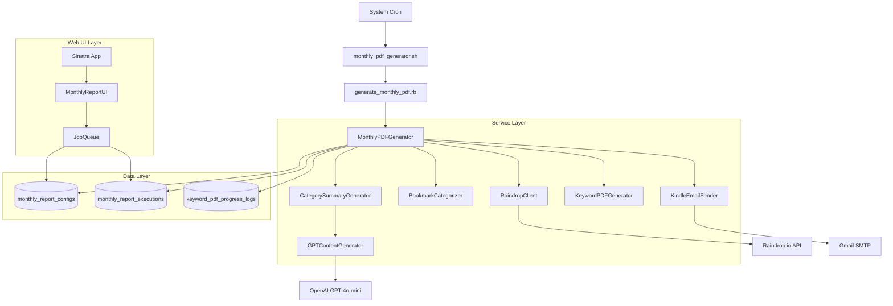
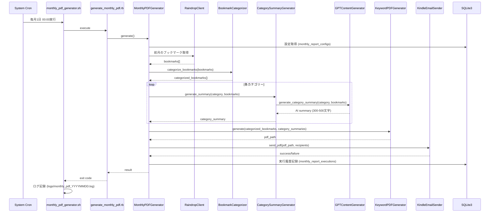
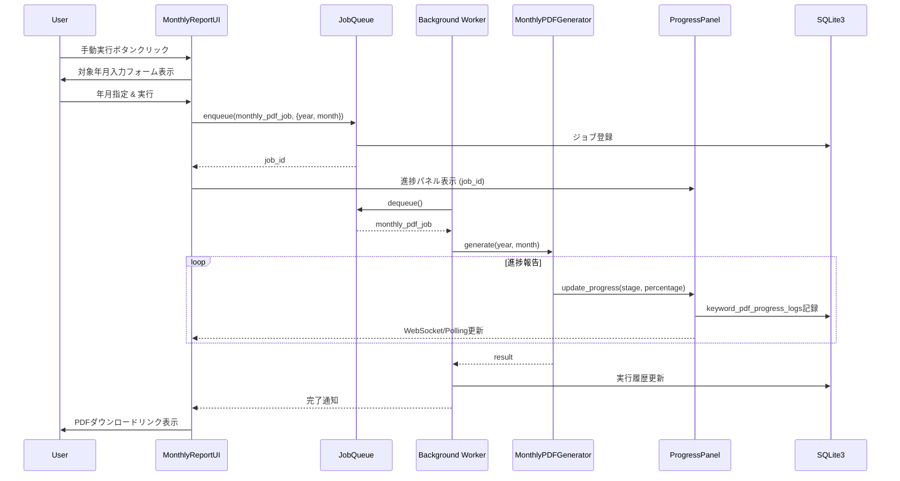

# Design Document: 月次PDFレポート自動配信機能

## Overview

本機能は、既存のRainpipeシステムに月次ブックマークサマリーレポートの自動生成・配信機能を追加します。既存の週次レポート機能（WeeklyPDFGenerator）と同様のアーキテクチャパターンを踏襲しつつ、カテゴリー別AIサマリー生成とスケジュール管理機能を追加します。

**Purpose**: ユーザーが毎月自動的にブックマークのサマリーレポートをPDF形式で受け取り、Kindleや他のデバイスで閲覧できるようにする。

**Users**: Rainpipeを使用してブックマークを管理しているユーザーが、月次の活動振り返りに利用する。

**Impact**: 現在の手動PDF生成ワークフローを自動化し、カテゴリー別の傾向分析機能を追加することで、ユーザーの情報整理効率を向上させる。

### Goals

- 月次ブックマークレポートの自動生成とメール配信を実現
- 既存の11カテゴリー分類を活用したカテゴリー別AIサマリー生成
- 既存機能（BookmarkCategorizer、GPTContentGenerator、KeywordPDFGenerator等）の最大限の再利用
- システムcron + Shellスクリプトによる堅牢なスケジューリング
- Web UIからの手動実行と実行履歴確認機能

### Non-Goals

- 新しいカテゴリー分類ロジックの実装（既存の11カテゴリーを使用）
- リアルタイム通知機能（月次バッチ処理のみ）
- PDF以外のフォーマット対応（HTML、EPUB等）
- スケジューラーライブラリ（rufus-scheduler、whenever等）の導入

## Architecture

### Existing Architecture Analysis

既存のRainpipeシステムは以下のService-Oriented Architectureを採用:

- **KeywordFilteredPDFService**: PDF生成のオーケストレーション
- **BookmarkCategorizer**: ブックマークのカテゴリー分類（11カテゴリー）
- **GPTContentGenerator**: OpenAI GPT-4o-miniを使用したサマリー・分析生成
- **KeywordPDFGenerator**: Prawnベースの日本語PDF生成
- **KindleEmailSender**: Gmail SMTP経由のメール送信
- **JobQueue**: バックグラウンドジョブ管理
- **ProgressReporter & ProgressCallback**: 進捗追跡とログ記録

週次レポート機能（WeeklyPDFGenerator）が既に存在し、システムcron + Shellスクリプトで運用されている。

### Architecture Pattern & Boundary Map



**Architecture Integration**:
- **選択パターン**: Service-Oriented Architecture（既存パターンを踏襲）
- **ドメイン境界**: 月次レポート機能は新規サービス（MonthlyPDFGenerator、CategorySummaryGenerator）として実装し、既存サービス（BookmarkCategorizer、GPTContentGenerator等）を呼び出す
- **既存パターンの保持**: WeeklyPDFGeneratorと同様のスケジューリング方式（システムcron + Shellスクリプト）
- **新コンポーネントの理由**:
  - `MonthlyPDFGenerator`: 月次固有のレイアウト（カテゴリー別セクション、視覚的区切り）を実装
  - `CategorySummaryGenerator`: カテゴリーごとのAIサマリー生成ロジックを分離
- **Steering準拠**: structure.mdのService-Oriented Architecture、tech.mdのBatch Processing Patterns、product.mdのPDF Generation機能と整合

### Technology Stack

| Layer | Choice / Version | Role in Feature | Notes |
|-------|------------------|-----------------|-------|
| Backend / Services | Ruby 3.x + Sinatra | 月次レポート生成サービス、Web UI | 既存スタックを継続使用 |
| Scheduling | System cron | 毎月1日午前0時に自動実行 | 既存の週次レポートと同じ方式 |
| PDF Generation | Prawn + prawn-table | カテゴリー別レイアウトのPDF生成 | 既存のKeywordPDFGeneratorを活用 |
| AI Summarization | OpenAI GPT-4o-mini | カテゴリー別AIサマリー生成 | 既存のGPTContentGeneratorを拡張 |
| Email Delivery | Mail gem + Gmail SMTP | PDF添付メール送信 | 既存のKindleEmailSenderを再利用 |
| Data / Storage | SQLite3 | 設定・実行履歴の永続化 | 新規テーブル: monthly_report_configs, monthly_report_executions |
| Progress Tracking | ProgressReporter + ProgressCallback | 進捗表示とログ記録 | 既存のkeyword_pdf_progress_logsテーブルを活用 |

## System Flows

### 自動実行フロー（Cron経由）



**フロー決定事項**:
- エラーハンドリング: 各ステップで例外をキャッチし、ログ記録後に次のステップへ進む（部分的成功を許容）
- リトライ戦略: GPT APIは既存のexponential backoffを適用、メール送信は最大3回リトライ
- タイムアウト: GPT APIタイムアウトは30秒、全体処理は30分でタイムアウト

### 手動実行フロー（Web UI経由）



**フロー決定事項**:
- 既存のJobQueueとProgressPanelを再利用
- WebSocketではなくPolling方式（既存の`/api/progress`エンドポイントを活用）
- 完了後、履歴パネルに結果を表示

## Requirements Traceability

| Requirement | Summary | Components | Interfaces | Flows |
|-------------|---------|------------|------------|-------|
| 1 | 月次レポートのスケジュール設定 | MonthlyReportScheduler, monthly_report_configs | UI設定画面、DB永続化 | Web UI → DB |
| 2 | 月次レポートデータの集計とカテゴリー分類 | MonthlyPDFGenerator, RaindropClient, BookmarkCategorizer | RaindropClient.get_monthly_bookmarks, BookmarkCategorizer.categorize_bookmarks | Raindrop API → Categorizer |
| 3 | カテゴリー別AIサマリーの生成 | CategorySummaryGenerator, GPTContentGenerator | GPTContentGenerator.generate_category_summary | CategorySummaryGenerator → GPT API |
| 4 | 月次PDFレポートの生成 | MonthlyPDFGenerator, KeywordPDFGenerator | KeywordPDFGenerator (拡張), Prawn API | MonthlyPDFGenerator → Prawn |
| 5 | 月次レポートのメール送信 | KindleEmailSender | KindleEmailSender.send_pdf | EmailSender → Gmail SMTP |
| 6 | 月次レポート設定の管理 | MonthlyReportUI, monthly_report_configs | Web UI CRUD, DB永続化 | Web UI → DB |
| 7 | 月次レポート実行履歴の記録 | monthly_report_executions, MonthlyReportUI | DB記録、Web UI表示 | DB ← MonthlyPDFGenerator, DB → Web UI |
| 8 | 手動での月次レポート実行 | MonthlyReportUI, JobQueue, MonthlyPDFGenerator | POST /api/monthly-report/generate, JobQueue.enqueue | Web UI → JobQueue → Worker |
| 9 | 既存機能との統合 | RaindropClient, BookmarkCategorizer, GPTContentGenerator, KeywordPDFGenerator, KindleEmailSender, JobQueue, ProgressReporter | 既存インターフェース全て | 全フロー |

## Components and Interfaces

| Component | Domain/Layer | Intent | Req Coverage | Key Dependencies (P0/P1) | Contracts |
|-----------|--------------|--------|--------------|--------------------------|-----------|
| MonthlyPDFGenerator | Service | 月次PDF生成のオーケストレーション | 2, 4 | RaindropClient (P0), BookmarkCategorizer (P0), CategorySummaryGenerator (P0), KeywordPDFGenerator (P0) | Service |
| CategorySummaryGenerator | Service | カテゴリー別AIサマリー生成 | 3 | GPTContentGenerator (P0) | Service |
| MonthlyReportUI | UI | Web UI（設定管理、手動実行、履歴表示） | 1, 6, 7, 8 | JobQueue (P0), monthly_report_configs (P0), monthly_report_executions (P0) | API, State |
| monthly_report_configs | Data | スケジュール設定とメール送信先の永続化 | 1, 6 | SQLite3 (P0) | State |
| monthly_report_executions | Data | 実行履歴の記録 | 7 | SQLite3 (P0), keyword_pdf_progress_logs (P1) | State |

### Service Layer

#### MonthlyPDFGenerator

| Field | Detail |
|-------|--------|
| Intent | 月次ブックマークレポートのPDF生成を統括し、カテゴリー別サマリー生成とメール送信を実行 |
| Requirements | 2, 4 |

**Responsibilities & Constraints**
- 前月1日〜末日のブックマークをRaindropClientから取得
- BookmarkCategorizerでカテゴリー別に分類
- CategorySummaryGeneratorで各カテゴリーのAIサマリーを生成
- カテゴリー別レイアウトでPDFを生成
- KindleEmailSenderで指定されたメールアドレスに送信
- 実行履歴をmonthly_report_executionsテーブルに記録

**Dependencies**
- Inbound: generate_monthly_pdf.rb（cronスクリプト）または JobQueue（手動実行） (P0)
- Outbound: RaindropClient — ブックマーク取得 (P0)
- Outbound: BookmarkCategorizer — カテゴリー分類 (P0)
- Outbound: CategorySummaryGenerator — カテゴリー別AIサマリー生成 (P0)
- Outbound: KeywordPDFGenerator — PDF生成 (P0)
- Outbound: KindleEmailSender — メール送信 (P0)
- Outbound: ProgressReporter — 進捗報告 (P1)
- External: monthly_report_configs (DB) — 設定取得 (P0)
- External: monthly_report_executions (DB) — 実行履歴記録 (P0)

**Contracts**: Service [X] / API [ ] / Event [ ] / Batch [X] / State [ ]

##### Service Interface

```ruby
class MonthlyPDFGenerator
  # @param year [Integer] 対象年（例: 2025）
  # @param month [Integer] 対象月（例: 11）
  # @param progress_callback [ProgressCallback, nil] 進捗報告用コールバック
  def initialize(year:, month:, progress_callback: nil)
    @year = year
    @month = month
    @progress_callback = progress_callback || ProgressCallback.null_callback
    @raindrop_client = RaindropClient.new
    @categorizer = BookmarkCategorizer.new
    @category_summary_generator = CategorySummaryGenerator.new
    @pdf_generator = KeywordPDFGenerator.new
    @email_sender = KindleEmailSender.new
  end

  # メインの実行メソッド
  # @return [Hash] { status: 'success' or 'error', pdf_path: String, execution_id: Integer, error: String }
  def generate
    # 1. 設定取得
    # 2. ブックマーク取得（前月1日〜末日）
    # 3. カテゴリー分類
    # 4. カテゴリー別サマリー生成
    # 5. PDF生成
    # 6. メール送信
    # 7. 実行履歴記録
  end

  private

  def get_config
    # monthly_report_configs から設定取得
  end

  def fetch_bookmarks(start_date, end_date)
    # RaindropClient.get_monthly_bookmarks 呼び出し
  end

  def categorize_bookmarks(bookmarks)
    # BookmarkCategorizer.categorize_bookmarks 呼び出し
  end

  def generate_category_summaries(categorized_bookmarks)
    # CategorySummaryGenerator.generate_summaries 呼び出し
  end

  def generate_pdf(categorized_bookmarks, category_summaries)
    # KeywordPDFGenerator を使用してカテゴリー別レイアウトでPDF生成
  end

  def send_email(pdf_path, recipients)
    # KindleEmailSender.send_pdf 呼び出し
  end

  def record_execution(result)
    # monthly_report_executions に記録
  end
end
```

**Preconditions**:
- `@year`と`@month`が有効な年月であること
- RaindropClientのAPI tokenが`.env`に設定されていること
- OpenAI API keyが`.env`に設定されていること（GPT使用時）
- Gmail SMTP設定が`.env`に設定されていること（メール送信時）

**Postconditions**:
- PDFファイルが`data/monthly_report_YYYYMM.pdf`に保存される
- 指定されたメールアドレスにPDFが送信される
- `monthly_report_executions`テーブルに実行履歴が記録される

**Invariants**:
- 生成されるPDFのファイルサイズは25MB以下
- カテゴリー内ブックマークが3件未満の場合、そのカテゴリーのサマリーは生成されない

##### Batch Contract

- **Trigger**: システムcron（毎月1日 00:00） または Web UI手動実行
- **Input**: 対象年月（year, month）、progress_callback（オプション）
- **Output**: PDFファイル（`data/monthly_report_YYYYMM.pdf`）、実行履歴レコード
- **Idempotency**: 同じ年月で複数回実行された場合、新しいPDFファイルが上書き生成される

**Implementation Notes**
- **Integration**: WeeklyPDFGeneratorと同様のパターンを踏襲し、既存サービスを組み合わせて実装
- **Validation**:
  - 年月の妥当性チェック（1 <= month <= 12、year >= 2020）
  - メールアドレスのフォーマット検証（既存のKindleEmailSenderを活用）
  - PDFファイルサイズチェック（25MB以下）
- **Risks**:
  - GPT APIレート制限: exponential backoffで対応、失敗したカテゴリーはスキップ
  - 大量ブックマークによるメモリ不足: 既存のチャンク処理（50件ずつ）を踏襲

#### CategorySummaryGenerator

| Field | Detail |
|-------|--------|
| Intent | カテゴリー別にブックマークのAIサマリーを生成する |
| Requirements | 3 |

**Responsibilities & Constraints**
- 各カテゴリー内のブックマーク（3件以上）からAIサマリーを生成
- GPTContentGeneratorの新規メソッド`generate_category_summary`を使用
- 主要トピック、注目記事、傾向分析を300-500文字で生成
- エラー時は当該カテゴリーをスキップしてログ記録

**Dependencies**
- Inbound: MonthlyPDFGenerator (P0)
- Outbound: GPTContentGenerator — GPT APIとのインタラクション (P0)

**Contracts**: Service [X] / API [ ] / Event [ ] / Batch [ ] / State [ ]

##### Service Interface

```ruby
class CategorySummaryGenerator
  # @param gpt_generator [GPTContentGenerator] GPT APIクライアント
  def initialize(gpt_generator = nil)
    @gpt_generator = gpt_generator || GPTContentGenerator.new(ENV['OPENAI_API_KEY'])
  end

  # カテゴリー別サマリーを生成
  # @param categorized_bookmarks [Hash] カテゴリー名 => ブックマーク配列
  # @return [Hash] カテゴリー名 => サマリー文字列
  def generate_summaries(categorized_bookmarks)
    summaries = {}

    categorized_bookmarks.each do |category, bookmarks|
      next if bookmarks.length < 3  # 3件未満はスキップ

      begin
        summary = @gpt_generator.generate_category_summary(category, bookmarks)
        summaries[category] = summary if summary && summary.length > 0
      rescue => e
        ProgressReporter.warning("カテゴリー #{category} のサマリー生成失敗: #{e.message}")
        next
      end
    end

    summaries
  end
end
```

**Preconditions**:
- `categorized_bookmarks`がHash形式（カテゴリー名 => ブックマーク配列）であること
- OpenAI API keyが設定されていること

**Postconditions**:
- 各カテゴリーのサマリーが300-500文字の範囲で生成される
- 3件未満のカテゴリーはスキップされる
- エラーが発生したカテゴリーはスキップされ、ログに記録される

**Implementation Notes**
- **Integration**: GPTContentGeneratorに`generate_category_summary`メソッドを追加する形で実装
- **Validation**:
  - カテゴリー内ブックマーク数のチェック（3件以上）
  - 生成されたサマリーの文字数チェック（300-500文字）
- **Risks**:
  - GPT APIレート制限: exponential backoffで対応
  - サマリー生成失敗時のスキップロジック実装

### UI Layer

#### MonthlyReportUI

| Field | Detail |
|-------|--------|
| Intent | Web UIで月次レポートの設定管理、手動実行、履歴表示を提供 |
| Requirements | 1, 6, 7, 8 |

**Responsibilities & Constraints**
- スケジュール設定のCRUD（有効/無効、実行日時、送信先メールアドレス）
- 手動実行ボタンと対象年月入力フォーム
- 進捗表示（既存のProgressPanelとLogPanelを再利用）
- 実行履歴の表示（過去12ヶ月分）
- PDFダウンロードリンクの提供

**Dependencies**
- Outbound: JobQueue — バックグラウンドジョブ登録 (P0)
- Outbound: monthly_report_configs (DB) — 設定CRUD (P0)
- Outbound: monthly_report_executions (DB) — 履歴取得 (P0)
- Outbound: ProgressPanel (JavaScript) — 進捗表示 (P1)
- Outbound: LogPanel (JavaScript) — ログ表示 (P1)

**Contracts**: Service [ ] / API [X] / Event [ ] / Batch [ ] / State [X]

##### API Contract

| Method | Endpoint | Request | Response | Errors |
|--------|----------|---------|----------|--------|
| GET | /api/monthly-report/config | - | `{ enabled: Boolean, schedule: String, email_addresses: String[], keyword_filter: String }` | 500 |
| POST | /api/monthly-report/config | `{ enabled, schedule, email_addresses, keyword_filter }` | `{ success: Boolean, config_id: Integer }` | 400, 500 |
| POST | /api/monthly-report/generate | `{ year: Integer, month: Integer }` | `{ job_id: String }` | 400, 500 |
| GET | /api/monthly-report/history | `?limit=10` | `{ executions: [{ id, year, month, status, created_at, pdf_path, error_message }] }` | 500 |

##### State Management

- **State model**:
  - `monthly_report_configs`: スケジュール設定とメール送信先
  - `monthly_report_executions`: 実行履歴（過去12ヶ月分）
- **Persistence**: SQLite3テーブルに永続化
- **Concurrency strategy**: 単一ユーザー環境のため、トランザクション不要

**Implementation Notes**
- **Integration**: 既存の`filtered_pdf.erb`と同様のUIパターンを踏襲
- **Validation**:
  - 年月の妥当性チェック（1 <= month <= 12、year >= 2020）
  - メールアドレスのフォーマット検証
- **Risks**: なし（単純なCRUD + 既存コンポーネントの再利用）

### Data Layer

#### monthly_report_configs

| Field | Detail |
|-------|--------|
| Intent | 月次レポートのスケジュール設定とメール送信先を永続化 |
| Requirements | 1, 6 |

**Physical Data Model (SQLite3)**:

```sql
CREATE TABLE monthly_report_configs (
  id INTEGER PRIMARY KEY AUTOINCREMENT,
  enabled BOOLEAN NOT NULL DEFAULT 1,
  schedule_day INTEGER NOT NULL DEFAULT 1,  -- 毎月X日（1-31）
  schedule_hour INTEGER NOT NULL DEFAULT 0,  -- 実行時刻（0-23）
  email_addresses TEXT NOT NULL,  -- カンマ区切り
  keyword_filter TEXT,  -- オプション（NULL可）
  created_at TIMESTAMP NOT NULL DEFAULT CURRENT_TIMESTAMP,
  updated_at TIMESTAMP NOT NULL DEFAULT CURRENT_TIMESTAMP
);

CREATE INDEX idx_monthly_report_configs_enabled ON monthly_report_configs(enabled);
```

**Constraints**:
- `schedule_day`: 1-31の範囲
- `schedule_hour`: 0-23の範囲
- `email_addresses`: カンマ区切りのメールアドレスリスト

#### monthly_report_executions

| Field | Detail |
|-------|--------|
| Intent | 月次レポートの実行履歴を記録 |
| Requirements | 7 |

**Physical Data Model (SQLite3)**:

```sql
CREATE TABLE monthly_report_executions (
  id INTEGER PRIMARY KEY AUTOINCREMENT,
  year INTEGER NOT NULL,
  month INTEGER NOT NULL,
  status TEXT NOT NULL,  -- 'pending', 'processing', 'completed', 'failed'
  started_at TIMESTAMP NOT NULL,
  completed_at TIMESTAMP,
  bookmark_count INTEGER,
  category_count INTEGER,
  pdf_path TEXT,
  pdf_size_bytes INTEGER,
  error_message TEXT,
  execution_duration_ms INTEGER,
  pdf_generation_id INTEGER,  -- FK to keyword_pdf_generations.id
  created_at TIMESTAMP NOT NULL DEFAULT CURRENT_TIMESTAMP,
  updated_at TIMESTAMP NOT NULL DEFAULT CURRENT_TIMESTAMP,

  FOREIGN KEY (pdf_generation_id) REFERENCES keyword_pdf_generations(id),
  CONSTRAINT year_month_unique UNIQUE (year, month, started_at)
);

CREATE INDEX idx_monthly_report_executions_status ON monthly_report_executions(status);
CREATE INDEX idx_monthly_report_executions_year_month ON monthly_report_executions(year, month);
CREATE INDEX idx_monthly_report_executions_started_at ON monthly_report_executions(started_at);
```

**Constraints**:
- `year`: 2020以降
- `month`: 1-12の範囲
- `status`: 'pending', 'processing', 'completed', 'failed'のいずれか
- 履歴保持期限: 過去12ヶ月分（古いレコードは定期削除）

## Error Handling

### Error Strategy

- **GPT APIエラー**: exponential backoffでリトライ（最大3回）、失敗したカテゴリーはスキップ
- **メール送信エラー**: 最大3回リトライ、失敗時はログ記録してエラーステータスを返す
- **ブックマーク取得エラー**: Raindrop APIエラー時は即座に失敗、エラーメッセージをmonthly_report_executionsに記録
- **PDF生成エラー**: 部分的成功を許容せず、エラー時はpdf_pathをNULLにしてエラーメッセージを記録

### Error Categories and Responses

**User Errors** (400):
- 無効な年月指定 → バリデーションエラーメッセージ
- メールアドレスフォーマット不正 → フォーマット検証エラー

**System Errors** (500):
- Raindrop API障害 → graceful degradation（エラーログ記録、リトライなし）
- GPT APIタイムアウト → exponential backoff（最大3回）
- Gmail SMTPエラー → リトライ（最大3回）、失敗時はエラーステータス

**Business Logic Errors**:
- ブックマーク0件 → レポート生成をスキップ、ログ記録
- カテゴリー内ブックマーク3件未満 → 当該カテゴリーのサマリー生成をスキップ

### Monitoring

- **ログファイル**: `logs/monthly_pdf_YYYYMMDD.log`（14日保持）
- **進捗ログ**: `keyword_pdf_progress_logs`テーブルに記録
- **実行履歴**: `monthly_report_executions`テーブルに記録
- **エラーレベル**: ERROR（致命的エラー）、WARNING（部分的失敗）、INFO（正常処理）

## Testing Strategy

### Unit Tests

1. **MonthlyPDFGenerator#generate**: 各ステップ（ブックマーク取得、カテゴリー分類、サマリー生成、PDF生成、メール送信）をモックして単体テスト
2. **CategorySummaryGenerator#generate_summaries**: 3件以上/未満のカテゴリーでスキップロジックをテスト
3. **GPTContentGenerator#generate_category_summary**: プロンプト生成とレスポンス解析をテスト
4. **monthly_report_configs/executions**: CRUD操作とバリデーションをテスト

### Integration Tests

1. **Cron → MonthlyPDFGenerator → PDF生成**: cronスクリプトからPDF生成までのエンドツーエンドテスト
2. **Web UI → JobQueue → MonthlyPDFGenerator**: 手動実行からPDF生成までのフロー
3. **BookmarkCategorizer → CategorySummaryGenerator → GPTContentGenerator**: カテゴリー分類からAIサマリー生成までのフロー
4. **MonthlyPDFGenerator → KindleEmailSender**: PDF生成からメール送信までのフロー

### E2E Tests

1. **自動実行フロー**: cronトリガー → PDF生成 → メール送信 → 履歴記録
2. **手動実行フロー**: Web UI操作 → ジョブ登録 → 進捗表示 → PDFダウンロード
3. **設定変更フロー**: Web UIで設定変更 → DB永続化 → 次回実行時に反映
4. **エラーハンドリング**: GPT APIエラー → カテゴリースキップ → 部分的成功
5. **履歴表示**: 過去12ヶ月分の履歴を正しく表示

### Performance Tests

1. **大量ブックマーク**: 500件のブックマークでPDF生成時間を測定（目標: 10分以内）
2. **カテゴリー数**: 11カテゴリー全てに対するAIサマリー生成時間を測定（目標: 5分以内）
3. **PDF生成**: カテゴリー別レイアウトでのPDF生成時間とメモリ使用量を測定
4. **同時実行**: 手動実行とcron実行が重複した場合の動作を確認（JobQueueのキューイングが正常に機能するか）

## Security Considerations

本機能は既存のRainpipeシステムと同じセキュリティ要件を踏襲します:

- **API Keys**: `.env`ファイルで管理（gitignore設定済み）
- **Gmail App Password**: メインパスワードではなくapp-specific passwordを使用
- **メールアドレス検証**: フォーマットチェックのみ（送信先の実在性は検証しない）
- **SQLインジェクション**: Prepared statementsを使用（SQLite3の標準機能）
- **XSS**: Web UIでの入力値をエスケープ（Sinatraのerb標準機能）

## Performance & Scalability

- **目標処理時間**: 100件のブックマークで5分以内、500件で15分以内
- **メモリ使用量**: 既存のチャンク処理（50件ずつ）でピークメモリを500MB以内に抑制
- **GPT APIレート制限**: exponential backoffで対応、1分あたり最大60リクエスト
- **PDF生成**: Prawnのcompress flagを有効化、25MB以下に制限
- **スケーラビリティ**: 単一ユーザー環境のため、並列実行は不要（cron実行とWeb UI手動実行の競合のみ考慮）

## Migration Strategy

### Phase 1: データベーステーブル作成

```ruby
# db/migrate/001_create_monthly_report_tables.rb
class CreateMonthlyReportTables < ActiveRecord::Migration
  def change
    create_table :monthly_report_configs do |t|
      t.boolean :enabled, null: false, default: true
      t.integer :schedule_day, null: false, default: 1
      t.integer :schedule_hour, null: false, default: 0
      t.integer :schedule_minute, null: false, default: 0
      t.text :email_addresses, null: false
      t.text :keyword_filter
      t.timestamps
    end

    create_table :monthly_report_executions do |t|
      t.integer :year, null: false
      t.integer :month, null: false
      t.text :status, null: false
      t.datetime :started_at, null: false
      t.datetime :completed_at
      t.integer :bookmark_count
      t.integer :category_count
      t.text :pdf_path
      t.integer :pdf_size_bytes
      t.text :error_message
      t.integer :execution_duration_ms
      t.integer :pdf_generation_id
      t.timestamps
    end

    add_index :monthly_report_configs, :enabled
    add_index :monthly_report_executions, :status
    add_index :monthly_report_executions, [:year, :month]
    add_index :monthly_report_executions, :started_at
  end
end
```

### Phase 2: サービスクラス実装とテスト

1. `CategorySummaryGenerator`を実装
2. `GPTContentGenerator#generate_category_summary`を追加
3. `MonthlyPDFGenerator`を実装
4. Unit testsとIntegration testsを実装

### Phase 3: Web UI実装

1. `/monthly-report`ページを作成
2. 設定管理UI（CRUD）
3. 手動実行UI（年月指定フォーム、進捗表示）
4. 履歴表示UI（過去12ヶ月分）

### Phase 4: Cronスクリプト実装とデプロイ

1. `monthly_pdf_generator.sh`を作成
2. `generate_monthly_pdf.rb`を作成
3. cron設定を追加（毎月1日 00:00）
4. ログローテーション設定（14日保持）

### Rollback Strategy

各フェーズで問題が発生した場合:
- Phase 1: テーブルをDROP
- Phase 2: サービスクラスを削除、既存機能には影響なし
- Phase 3: Web UIルートを削除、既存UIには影響なし
- Phase 4: cron設定を削除、cronスクリプトを削除

## Supporting References

### GPTContentGenerator拡張メソッド

```ruby
# gpt_content_generator.rb に追加
class GPTContentGenerator
  # カテゴリー別サマリーを生成
  # @param category_name [String] カテゴリー名（例: "🔧 技術・開発"）
  # @param bookmarks [Array<Hash>] ブックマーク配列
  # @return [String] AIサマリー（300-500文字）
  def generate_category_summary(category_name, bookmarks)
    titles = bookmarks.map { |b| "- #{b['title']}" }.join("\n")

    prompt = <<~PROMPT
      以下は「#{category_name}」カテゴリーに分類されたブックマークのリストです。

      #{titles}

      このカテゴリーの主要トピック、注目記事、傾向分析を300-500文字でまとめてください。
      具体的な記事タイトルに言及しながら、このカテゴリーの活動傾向を分析してください。
    PROMPT

    messages = [
      { role: 'system', content: 'あなたは情報整理の専門家です。ブックマークのカテゴリー別サマリーを簡潔にまとめることが得意です。' },
      { role: 'user', content: prompt }
    ]

    begin
      response = retry_with_backoff do
        @client.chat(
          parameters: {
            model: @model,
            messages: messages,
            temperature: 0.7,
            max_tokens: 500
          }
        )
      end

      summary = response.dig('choices', 0, 'message', 'content')
      return summary.strip if summary && summary.strip.length > 0

      nil
    rescue => e
      ProgressReporter.error("カテゴリーサマリー生成失敗", e.message)
      raise
    end
  end
end
```

### PDF生成カテゴリー別レイアウト例

```ruby
# monthly_pdf_generator.rb の generate_pdf メソッド内
def generate_pdf(categorized_bookmarks, category_summaries)
  pdf = Prawn::Document.new(
    page_size: 'A4',
    margin: 40,
    compress: true
  )

  # 日本語フォント設定
  pdf.font_families.update('ipag' => { normal: '/usr/share/fonts/truetype/fonts-japanese-gothic.ttf' })
  pdf.font 'ipag'

  # タイトル
  pdf.text "月次サマリーレポート (#{@year}年#{@month}月)", size: 24, style: :bold
  pdf.move_down 20

  # 全体サマリー
  # ...

  # カテゴリー別セクション
  categorized_bookmarks.each do |category, bookmarks|
    pdf.start_new_page

    # カテゴリーヘッダー（背景色付き）
    pdf.fill_color 'F5F5F5'
    pdf.fill_rectangle [0, pdf.cursor], pdf.bounds.width, 40
    pdf.fill_color '000000'

    pdf.bounding_box([10, pdf.cursor - 10], width: pdf.bounds.width - 20) do
      pdf.text category, size: 18, style: :bold
      pdf.text "#{bookmarks.length}件", size: 12, color: '666666'
    end

    pdf.move_down 50

    # カテゴリーサマリー
    if category_summaries[category]
      pdf.text "📝 AIサマリー", size: 14, style: :bold
      pdf.move_down 10
      pdf.text category_summaries[category], size: 10, leading: 4
      pdf.move_down 20
    end

    # セパレーター線
    pdf.stroke_horizontal_line 0, pdf.bounds.width, at: pdf.cursor
    pdf.move_down 20

    # ブックマーク詳細
    bookmarks.each_with_index do |bookmark, idx|
      pdf.text "#{idx + 1}. #{bookmark['title']}", size: 12, style: :bold
      pdf.text bookmark['url'], size: 9, color: '0000FF'
      pdf.move_down 10
    end
  end

  pdf_path = "data/monthly_report_#{@year}#{@month.to_s.rjust(2, '0')}.pdf"
  pdf.render_file(pdf_path)

  pdf_path
end
```
