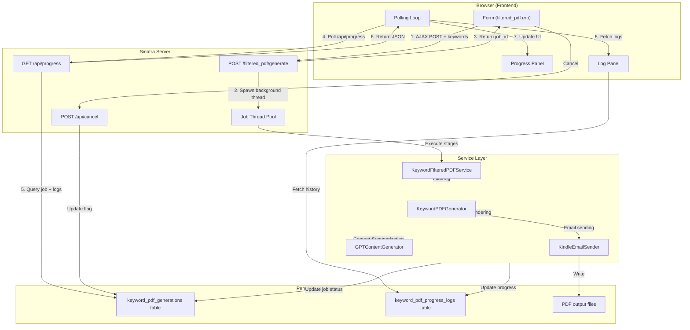
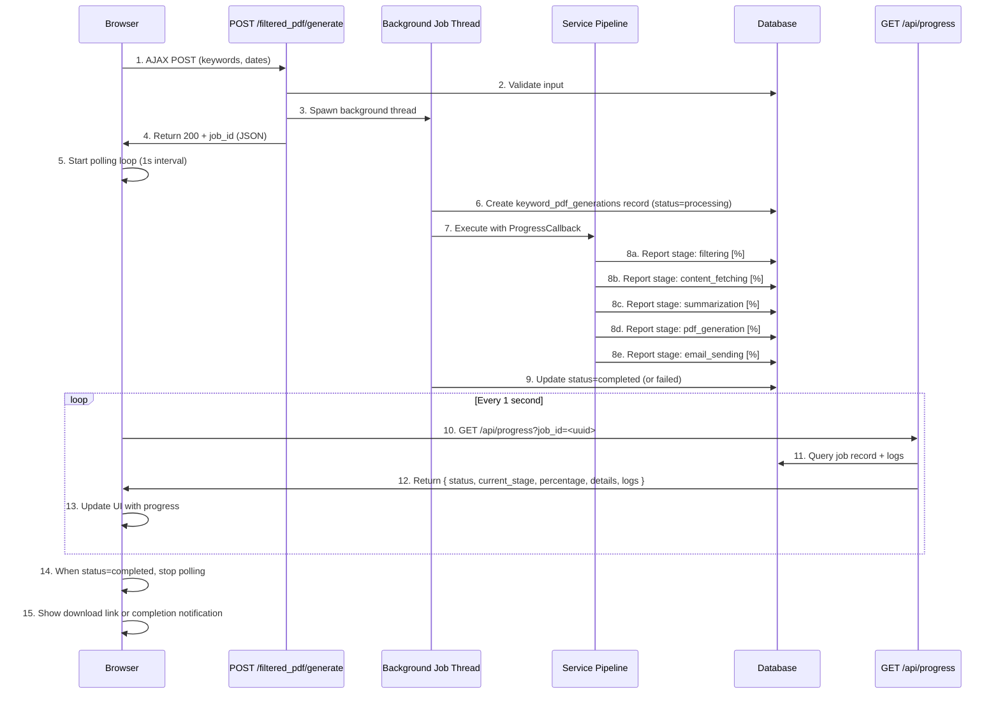
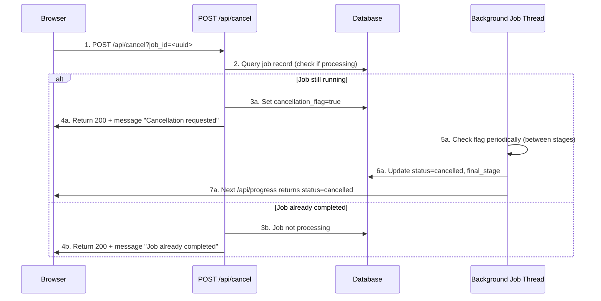

# Technical Design: Web UI Filtered PDF Progress Display

---

## Overview

This feature enhances the Rainpipe filtered PDF generation experience by adding real-time progress updates to the Web UI. Currently, users initiate filtered PDF generation from `/filtered_pdf` and wait synchronously for the result, with no visibility into intermediate processing stages. This design enables users to monitor filtering, content fetching, GPT summarization, PDF rendering, and email delivery stages as they execute, with real-time percentage indicators and a persistent log panel showing execution history.

**Users**: Users of the Rainpipe Web UI who generate filtered PDFs with keywords and date ranges will utilize this feature to:
- Monitor progress of long-running PDF generation (typically 2-5 minutes)
- Identify where processing slows down or stalls
- Cancel in-progress jobs if needed
- View historical execution logs for completed and failed jobs

**Impact**: Transforms the user experience from "submit and wait" (blocking request) to "submit and monitor" (real-time feedback), enabling concurrent PDF generations and providing visibility into system behavior.

### Goals

- Enable real-time progress tracking across five processing stages (filtering, content fetching, summarization, PDF generation, email sending)
- Provide stage-specific metrics (bookmark counts, API calls, file size, email status)
- Support at least 1 progress update per second as specified in requirement 1.2
- Display historical execution logs of completed and failed jobs
- Allow users to cancel in-progress jobs with confirmation
- Maintain backward compatibility with existing filtered PDF generation pipeline
- Support multiple concurrent PDF generation jobs

### Non-Goals

- Mobile app or native client progress display
- WebSocket real-time connection (polling is sufficient per specification)
- Progress analytics dashboard or historical trend analysis
- External monitoring or alerting systems
- Full job queue infrastructure (Sidekiq/Redis) - simple threading model for MVP

---

## Architecture

### Existing Architecture Analysis

The current Rainpipe filtered PDF generation follows a synchronous, service-oriented pipeline:

1. **Request Handler** (`app.rb:437-590`): POST /filtered_pdf/generate validates input, checks for concurrent jobs, executes services sequentially, generates PDF, and streams response
2. **Service Orchestration** (`KeywordFilteredPDFService`): Coordinates filtering, content fetching, and summarization in a single transaction
3. **Database Tracking** (`keyword_pdf_generations` table): Records status only at job completion (status: pending → processing → completed/failed)
4. **Frontend** (`views/filtered_pdf.erb`): Form-based submission with no progress updates during execution

**Key Constraints**:
- All processing happens in a single HTTP request (synchronous execution)
- No async job queue or background worker system
- Database tracks only overall status, not intermediate stage progress
- ProgressReporter utility outputs to console only (not integrated with Web UI)
- Current implementation prevents concurrent PDF generations (single global lock)
- No WebSocket or polling mechanism exists

### Architecture Pattern & Boundary Map



**Architecture Decisions**:

1. **Separation of Concerns**:
   - Request handler spawns background job and returns immediately
   - Background job executes service pipeline with progress callbacks
   - API endpoint aggregates job status and logs for UI consumption
   - Frontend independently polls API and updates UI

2. **Job State Management**:
   - Single source of truth: `keyword_pdf_generations` table
   - Job lifecycle: pending → processing → completed/failed (with cancellation support)
   - Intermediate state tracked in separate `keyword_pdf_progress_logs` table
   - UUID-based job identification for secure, stateless lookups

3. **Service Layer Integration**:
   - Minimal changes to existing service code
   - Progress callback interface injected during service initialization
   - Services remain testable and can work with or without progress reporting
   - Backward compatible with CLI batch execution

4. **Data Persistence**:
   - Job state in keyword_pdf_generations (one row per job)
   - Progress logs in keyword_pdf_progress_logs (multiple rows per job, one per stage transition)
   - PDF files stored in /data directory as before
   - All state survives across HTTP requests and polling cycles

---

## System Flows

### Job Submission and Monitoring



**Key Flow Decisions**:

1. **Immediate Job ID Return** (step 4): Handler spawns thread and returns job ID within milliseconds, unblocking client
2. **Progress Logging** (steps 8a-8e): Each service calls callback after completing a logical stage
3. **Polling Loop** (steps 10-13): Browser polls every 1 second, matching requirement 1.2
4. **Graceful Polling Exit** (step 14): Client detects completion (status != "processing") and stops polling
5. **Error Handling** (not shown): If thread encounters error, status updates to "failed" with error_message

### Job Cancellation Flow



---

## Requirements Traceability

| Requirement ID | Summary | Components | Interfaces | Flows |
|---|---|---|---|---|
| 1.1 | Display real-time updates for each stage | ProgressPanel (UI), ProgressCallback (service) | /api/progress | Job Submission flow, polling loop |
| 1.2 | Update at least once per second | Frontend polling timer | /api/progress (1s interval) | Job Submission flow, step 10-13 |
| 1.3 | Display status when navigating to /filtered_pdf | ProgressPanel with resume logic | /api/progress (check job_id param) | Resume Monitoring |
| 1.4 | User-friendly format with visual indicators | ProgressPanel (CSS + progress bar) | API response with percentage | Job Submission flow, step 13 |
| 2.1 | Display filtering stage metrics | FilteringProgressComponent | /api/progress.stage_details | Filtering stage callback |
| 2.2 | Display content fetching metrics | ContentFetchingProgressComponent | /api/progress.stage_details | Content fetching callback |
| 2.3 | Display summarization metrics | SummarizationProgressComponent | /api/progress.stage_details | Summarization callback |
| 2.4 | Display PDF generation metrics | PDFGenerationProgressComponent | /api/progress.stage_details | PDF generation callback |
| 2.5 | Display email delivery metrics | EmailProgressComponent | /api/progress.stage_details | Email sending callback |
| 3.1 | Display error message with remediation | ErrorPanel | API response with error_info | Error handling |
| 3.2 | Validate inputs before job creation | FormValidator | Form submission handler | Job Submission, step 2 |
| 3.3 | Preserve and display error information | JobRecord.error_message | /api/progress.error_info | Error handling |
| 4.1 | Provide /api/progress endpoint returning JSON | ProgressAPIEndpoint | GET /api/progress | All polling |
| 4.2 | Return structured progress data | ProgressAPIEndpoint | /api/progress response schema | Job Submission flow |
| 4.3 | Manage jobs with persisted state | JobQueue (threading + DB) | keyword_pdf_generations table | All flows |
| 4.4 | Retrieve job status by ID | ProgressAPIEndpoint | GET /api/progress?job_id=<uuid> | All flows |
| 5.1 | Use polling (WebSocket optional) | PollingManager (JS) | /api/progress endpoint | Job Submission, step 10 |
| 5.2 | Auto-update without user interaction | PollingManager + ProgressPanel | /api/progress (continuous) | Job Submission, steps 10-15 |
| 5.3 | Allow job cancellation with confirmation | CancelButton + ConfirmDialog | POST /api/cancel | Job Cancellation flow |
| 5.4 | Display download link on completion | CompletionPanel | /api/progress + file path | Job Submission, step 15 |
| 6.1 | Track multiple concurrent jobs | JobQueue (thread pool) | keyword_pdf_generations (user_id nullable) | All flows |
| 6.2 | Store job metadata for reference | JobRecord + ProgressLogs | keyword_pdf_generations + logs table | All flows |
| 6.3 | Resume tracking when returning | ResumeMonitoring (JS) | /api/progress (job_id in URL param) | Resume Monitoring |
| 7.1 | Display log panel at bottom of page | LogPanel (UI component) | keyword_pdf_progress_logs table | All flows |
| 7.2 | Show timestamp, stage, message | LogEntry (UI component) | /api/progress.logs array | Polling loop |
| 7.3 | Auto-scroll to latest entries | LogPanel (JavaScript) | /api/progress.logs array | Job Submission, step 13 |
| 7.4 | Display logs from previous executions | LogPanel with history selector | /api/logs/history?job_id=<uuid> | History review |
| 7.5 | NOT regenerate completed jobs | UI read-only flag | No re-execution endpoint | Completed jobs only |

---

## Components and Interfaces

### Component Summary

| Component | Domain | Intent | Requirements | Key Dependencies | Contracts |
|---|---|---|---|---|---|
| **ProgressAPIEndpoint** | Backend API | Expose job status and logs | 4.1, 4.2, 4.4 | keyword_pdf_generations table, logging | API ✓ |
| **ProgressCallback** | Service Integration | Inject progress updates into services | 4.3, 2.1-2.5 | KeywordFilteredPDFService, etc. | Service ✓ |
| **JobQueue** | Job Management | Spawn and track background jobs | 4.3, 6.1, 6.2 | Thread, Database | Service ✓, State ✓ |
| **ProgressPanel** | Frontend UI | Display real-time progress | 1.1, 1.2, 1.4 | PollingManager, CSS | State ✓ |
| **PollingManager** | Frontend Logic | Fetch updates periodically | 5.1, 5.2 | /api/progress endpoint | Service ✓ |
| **LogPanel** | Frontend UI | Display execution logs | 7.1-7.4 | /api/progress.logs, LogEntry | State ✓ |
| **CancelButton** | Frontend UI | Initiate job cancellation | 5.3 | /api/cancel endpoint | API ✓ |
| **FormValidator** | Input Validation | Validate form inputs | 3.2 | (existing) | (no change) |

---

### Backend API Layer

#### ProgressAPIEndpoint

| Field | Detail |
|-------|--------|
| Intent | Expose job progress and execution logs as JSON for frontend polling |
| Requirements | 4.1, 4.2, 4.4, 1.3, 2.1-2.5, 3.1, 5.1, 5.2, 6.2, 7.1-7.2 |
| Owner | Backend Lead |

**Responsibilities & Constraints**
- Query job record by UUID from keyword_pdf_generations table
- Aggregate progress logs from keyword_pdf_progress_logs table
- Return complete job state for UI rendering
- Support concurrent multi-job queries (per UUID isolation)
- 404 response if job_id not found (user must supply valid UUID)

**Dependencies**
- Inbound: PollingManager (JavaScript polling) — Essential (P0)
- Outbound: Database (SQLite) — Essential (P0)
- External: (none)

**Contracts**: API ✓

##### API Contract

| Method | Endpoint | Request | Response | Errors |
|--------|----------|---------|----------|--------|
| GET | /api/progress | ?job_id=<uuid> | ProgressResponse (see schema below) | 400 (missing job_id), 404 (not found), 500 (DB error) |
| POST | /api/cancel | ?job_id=<uuid> | {success: bool, message: string} | 400 (missing job_id), 404 (not found), 500 (DB error) |

**ProgressResponse Schema** (JSON):
```json
{
  "job_id": "uuid-string",
  "status": "processing|completed|failed|cancelled",
  "current_stage": "filtering|content_fetching|summarization|pdf_generation|email_sending|null",
  "percentage": 0-100,
  "stage_details": {
    "filtering": {
      "bookmarks_retrieved": 150,
      "bookmarks_after_filter": 45
    },
    "content_fetching": {
      "gatherly_jobs": 3,
      "polling_attempts": 5,
      "completion_status": "in_progress"
    },
    "summarization": {
      "current_bookmark": 23,
      "total_bookmarks": 45
    },
    "pdf_generation": {
      "page_count": 87,
      "file_size_bytes": 2450000
    },
    "email_sending": {
      "recipient": "user@kindle.com",
      "file_size_bytes": 2450000,
      "status": "pending|sent|failed"
    }
  },
  "logs": [
    {
      "timestamp": "2025-11-14T10:30:45Z",
      "stage": "filtering",
      "message": "50 bookmarks filtered"
    },
    ...
  ],
  "error_info": {
    "error_type": "GatherlyAPITimeout",
    "context": "Content fetching failed after 3 retries",
    "suggested_remedy": "Wait 5 minutes and retry, or adjust parameters"
  }
}
```

**Implementation Notes**
- Integration: Add new route to app.rb, create APIProgress controller class
- Validation: Query parameter validation (UUID format check)
- Risks: Database query performance for jobs with many log entries (index by job_id)

---

### Service Integration Layer

#### ProgressCallback

| Field | Detail |
|-------|--------|
| Intent | Interface for services to report progress updates back to job management system |
| Requirements | 2.1-2.5, 4.3, 6.2 |
| Owner | Backend Lead |

**Responsibilities & Constraints**
- Receive stage name, percentage, and stage-specific details from services
- Update keyword_pdf_generations record (current_stage, percentage)
- Write entry to keyword_pdf_progress_logs table (timestamp, stage, message)
- Non-blocking: log writes should not delay service execution (consider async queue)
- Support null callback (for CLI/batch execution without Web UI)

**Dependencies**
- Inbound: KeywordFilteredPDFService, GPTContentGenerator, KeywordPDFGenerator, KindleEmailSender — Essential (P0)
- Outbound: Database (SQLite), optional Job Queue for async logging — Essential (P0)
- External: (none)

**Contracts**: Service ✓

##### Service Interface

```ruby
class ProgressCallback
  # Report stage progress update
  # @param stage_name [String] one of: filtering, content_fetching, summarization, pdf_generation, email_sending
  # @param percentage [Integer] 0-100
  # @param details [Hash] stage-specific metrics (see schema in ProgressResponse)
  # @return [void]
  def report_stage(stage_name, percentage, details = {})
    # Implementation: update DB, create log entry
  end

  # Check if cancellation was requested by user
  # @return [Boolean] true if user clicked cancel
  def cancellation_requested?
    # Implementation: query job record, check cancellation_flag
  end

  # Optional: Report non-stage events (warnings, retries)
  # @param event_type [String] retry, warning, info
  # @param message [String] user-facing message
  # @return [void]
  def report_event(event_type, message)
    # Implementation: log to progress_logs with event_type
  end
end
```

- **Preconditions**:
  - stage_name must be valid (validate before calling)
  - percentage in 0-100 range
  - details hash matches schema for stage

- **Postconditions**:
  - keyword_pdf_generations record updated (current_stage, percentage)
  - keyword_pdf_progress_logs entry created
  - All updates committed to database

- **Invariants**:
  - Job remains in same status during callback (callback doesn't transition status)
  - Percentage monotonically increases (no backward progress)
  - One stage active at a time

**Implementation Notes**
- Integration: Pass callback to services during initialization (constructor param)
- Validation: Validate stage_name against allowed values; validate percentage range
- Risks: Database write locking if many concurrent jobs update simultaneously (mitigate with connection pooling)

---

### Job Queue Management

#### JobQueue

| Field | Detail |
|-------|--------|
| Intent | Spawn and manage background job threads for PDF generation |
| Requirements | 4.3, 6.1, 6.2 |
| Owner | Backend Lead |

**Responsibilities & Constraints**
- Spawn new Thread for each filtered_pdf/generate request
- Create keyword_pdf_generations record before job starts
- Execute service pipeline with ProgressCallback injected
- Handle uncaught exceptions, mark job as failed
- Support concurrent job execution (multiple users simultaneously)
- Persist job state to keyword_pdf_generations table

**Dependencies**
- Inbound: POST /filtered_pdf/generate handler — Essential (P0)
- Outbound: KeywordFilteredPDFService and downstream services — Essential (P0)
- Outbound: Database (SQLite) for job state — Essential (P0)
- External: None (uses Ruby Thread built-in)

**Contracts**: Service ✓, State ✓

##### Service Interface

```ruby
class JobQueue
  # Spawn new background job for PDF generation
  # @param keywords [String] comma/newline separated keywords
  # @param date_start [Date] start of date range
  # @param date_end [Date] end of date range
  # @param send_to_kindle [Boolean] whether to email to Kindle
  # @param kindle_email [String] Kindle email address
  # @return [String] job UUID for polling
  def enqueue(keywords:, date_start:, date_end:, send_to_kindle: false, kindle_email: nil)
    # Implementation: create DB record, spawn thread, return UUID
  end

  # Query job status by UUID
  # @param job_id [String] UUID returned by enqueue
  # @return [Hash] job record with status, stage, percentage, etc.
  def get_job(job_id)
    # Implementation: query keyword_pdf_generations
  end

  # Request cancellation of in-progress job
  # @param job_id [String] UUID
  # @return [Boolean] true if cancellation flag set
  def request_cancel(job_id)
    # Implementation: set cancellation_flag in DB
  end
end
```

- **Preconditions**:
  - keywords, dates, and email validated by FormValidator
  - No duplicate concurrent job_ids (UUID uniqueness)

- **Postconditions**:
  - keyword_pdf_generations record created (status=pending initially)
  - Background thread spawned
  - Job UUID returned to caller within milliseconds

- **Invariants**:
  - Each job_id is unique (UUID)
  - Job state consistent with database record
  - One status value at a time

**Implementation Notes**
- Integration: Create JobQueue singleton or class method, call from POST /filtered_pdf/generate
- Validation: Validate UUID format in get_job before querying DB
- Risks: Thread accumulation if threads don't complete (add timeout, thread pool size limit)

---

### Frontend UI Layer

#### ProgressPanel

| Field | Detail |
|-------|--------|
| Intent | Display real-time progress of PDF generation to user |
| Requirements | 1.1, 1.2, 1.4, 2.1-2.5 |
| Owner | Frontend Lead |

**Responsibilities & Constraints**
- Render current_stage text and percentage as progress bar
- Display stage-specific metrics (bookmark counts, API calls, file size, etc.)
- Update DOM without full page reload (AJAX-driven)
- Show stage-by-stage visual progression (filtering → content_fetching → ... → completed)
- Handle error display with actionable remediation message
- Responsive design: works on desktop and tablet

**Dependencies**
- Inbound: PollingManager (updates) — Essential (P0)
- Outbound: CSS styling, DOM manipulation (vanilla JavaScript) — Essential (P0)
- External: Bootstrap CSS framework (existing) — Informational (P2)

**Contracts**: State ✓

**Implementation Notes**
- Integration: Insert ProgressPanel HTML element into filtered_pdf.erb form area
- Validation: Validate API response schema before rendering (type-safe updates)
- Risks: Large number of log entries may cause scroll performance issues (implement virtual scrolling if needed)

---

#### PollingManager

| Field | Detail |
|-------|--------|
| Intent | Fetch progress updates from backend every 1 second while job is in progress |
| Requirements | 5.1, 5.2, 1.2 |
| Owner | Frontend Lead |

**Responsibilities & Constraints**
- Start polling loop after form submission (when job_id received)
- Poll /api/progress endpoint every 1000ms (requirement 1.2)
- Stop polling when status transitions to completed/failed/cancelled
- Implement exponential backoff for completed jobs (avoid wasting requests)
- Handle network errors gracefully (retry with backoff)
- Resume polling if user navigates away and returns (check URL param for job_id)

**Dependencies**
- Inbound: Form submission handler, ProgressPanel, LogPanel — Essential (P0)
- Outbound: /api/progress endpoint — Essential (P0)
- External: Fetch API or XMLHttpRequest (browser built-in) — Essential (P0)

**Contracts**: Service ✓

**Implementation Notes**
- Integration: Add to filtered_pdf.erb JavaScript section, handle AJAX POST response
- Validation: Parse JSON response, validate status field values (processing/completed/failed/cancelled)
- Risks: Network latency may cause polling interval to exceed 1s (add retry logic, acceptable if within tolerance)

---

#### LogPanel

| Field | Detail |
|-------|--------|
| Intent | Display historical execution logs of current and past PDF generation jobs |
| Requirements | 7.1-7.4 |
| Owner | Frontend Lead |

**Responsibilities & Constraints**
- Render log entries in reverse chronological order (newest first)
- Show timestamp, stage, and message for each entry
- Auto-scroll to show latest entries as they arrive during execution
- Support viewing logs from previous completed jobs (history selector)
- Non-interactive (read-only, no editing or replay)
- Remember scroll position when switching between jobs (optional UX enhancement)

**Dependencies**
- Inbound: PollingManager (live log entries) — Essential (P0)
- Outbound: CSS styling, DOM manipulation — Essential (P0)
- External: Bootstrap CSS for styling — Informational (P2)

**Contracts**: State ✓

**Implementation Notes**
- Integration: Insert LogPanel HTML element below ProgressPanel in filtered_pdf.erb
- Validation: Validate log entry schema (timestamp ISO 8601, stage enum, message string)
- Risks: Very large log files (1000+ entries) may cause UI lag (implement virtual scrolling or pagination)

---

#### CancelButton

| Field | Detail |
|-------|--------|
| Intent | Allow user to request cancellation of in-progress PDF generation job |
| Requirements | 5.3 |
| Owner | Frontend Lead |

**Responsibilities & Constraints**
- Display cancel button only when status="processing"
- Show confirmation dialog before submitting cancellation request
- Send POST /api/cancel with job_id parameter
- Update UI to reflect cancellation (show "Job cancelled" message)
- Disable button after cancellation requested (prevent double-submit)
- Handle cancellation request errors gracefully

**Dependencies**
- Inbound: ProgressPanel (status), user interaction — Essential (P0)
- Outbound: /api/cancel endpoint — Essential (P0)
- External: Browser confirm() dialog or custom modal — Informational (P2)

**Contracts**: API ✓

**Implementation Notes**
- Integration: Add button to ProgressPanel, bind click handler with confirmation
- Validation: Check status="processing" before enabling button
- Risks: Race condition if job completes between cancel request and completion (acceptable, graceful)

---

### Data Persistence Layer

#### keyword_pdf_generations Table (Extended)

**New Columns** (in addition to existing schema):

```sql
ALTER TABLE keyword_pdf_generations ADD COLUMN (
  cancellation_flag BOOLEAN DEFAULT 0,          -- Set to 1 when user requests cancel
  current_stage TEXT DEFAULT NULL,               -- filtering|content_fetching|summarization|pdf_generation|email_sending
  current_percentage INTEGER DEFAULT 0,          -- 0-100 progress indicator
  user_id TEXT DEFAULT NULL,                     -- Optional: for multi-user concurrency tracking
  CONSTRAINT stage_enum CHECK (current_stage IN ('filtering', 'content_fetching', 'summarization', 'pdf_generation', 'email_sending', NULL))
);

CREATE INDEX idx_keyword_pdf_generations_user_id ON keyword_pdf_generations(user_id, created_at);
```

#### keyword_pdf_progress_logs Table (New)

```sql
CREATE TABLE keyword_pdf_progress_logs (
  id INTEGER PRIMARY KEY AUTOINCREMENT,
  job_id TEXT NOT NULL,                         -- Foreign key to keyword_pdf_generations.uuid
  stage TEXT NOT NULL,                          -- filtering|content_fetching|summarization|pdf_generation|email_sending|event
  event_type TEXT DEFAULT 'stage_update',       -- stage_update|retry|warning|info|error
  percentage INTEGER,                            -- Progress percentage (nullable for events)
  message TEXT NOT NULL,                        -- User-friendly log message
  details JSON,                                  -- Optional: JSON blob with metrics
  timestamp TIMESTAMP DEFAULT CURRENT_TIMESTAMP NOT NULL,

  FOREIGN KEY (job_id) REFERENCES keyword_pdf_generations(uuid),
  CONSTRAINT stage_enum CHECK (stage IN ('filtering', 'content_fetching', 'summarization', 'pdf_generation', 'email_sending', 'event')),
  CONSTRAINT event_enum CHECK (event_type IN ('stage_update', 'retry', 'warning', 'info', 'error'))
);

CREATE INDEX idx_keyword_pdf_progress_logs_job_id ON keyword_pdf_progress_logs(job_id, timestamp DESC);
CREATE INDEX idx_keyword_pdf_progress_logs_timestamp ON keyword_pdf_progress_logs(timestamp DESC);
```

**Details Column Schema** (JSON):
```json
{
  "filtering": {
    "bookmarks_retrieved": 150,
    "bookmarks_after_keyword_filter": 45,
    "bookmarks_after_date_filter": 45
  },
  "content_fetching": {
    "gatherly_jobs_created": 3,
    "polling_attempts": 5,
    "content_sources": ["gatherly", "cached"],
    "content_retrieved": 43
  },
  "summarization": {
    "current_bookmark": 23,
    "total_bookmarks": 45,
    "gpt_api_calls": 23,
    "gpt_errors_retried": 2
  },
  "pdf_generation": {
    "page_count": 87,
    "file_size_bytes": 2450000,
    "memory_usage_mb": 120
  },
  "email_sending": {
    "recipient": "user@kindle.com",
    "file_size_bytes": 2450000,
    "email_status": "sent",
    "send_time_ms": 1200
  }
}
```

---

## Error Handling

### Error Strategy

The feature follows a "fail-safe with user guidance" approach: if an error occurs during PDF generation, the job status updates to "failed", the error is logged with categorization, and the user sees an actionable message.

### Error Categories and Responses

**Validation Errors** (4xx):
- **Invalid keywords**: Return 400 to form, display field validation message ("Keywords required")
- **Invalid date range**: Return 400, display message ("End date must be after start date")
- **Missing Kindle email**: Return 400 if send_to_kindle=true but email blank

**Job State Errors** (4xx):
- **Job not found**: Return 404 from /api/progress, UI shows "Job not found" message
- **Job already completed**: Cancellation request returns 200 with "Job already completed" message

**Processing Errors** (5xx, handled gracefully):
- **Gatherly API timeout**: Mark job as failed with "Content fetching timed out. Wait 5 minutes and retry."
- **GPT API rate limit**: Retry with exponential backoff (existing logic); if all retries fail, mark job failed with "GPT API rate limited. Try again in 10 minutes."
- **PDF generation out of memory**: Catch exception, mark job failed with "PDF too large for this content. Reduce keyword scope or date range."
- **Email delivery failed**: Mark job as failed with "Email delivery failed. Check Kindle email address and retry."

### Monitoring

**Error Logging**:
- All errors captured in keyword_pdf_progress_logs with event_type='error'
- Error record includes: error_type, context, suggested_remedy
- Database retention: indefinite (for post-mortem analysis)

**Error Visibility**:
- Current job error: displayed in ProgressPanel error section
- Historical errors: viewable in LogPanel history
- No external alerting (out of scope)

---

## Testing Strategy

### Unit Tests

1. **ProgressCallback.report_stage()**
   - Validates stage name, percentage range, details schema
   - Confirms database updates (keyword_pdf_generations row + progress_logs entry)
   - Tests with null callback (CLI mode)

2. **JobQueue.enqueue()**
   - Creates keyword_pdf_generations record with correct initial state
   - Spawns background thread without blocking
   - Returns valid UUID

3. **ProgressAPIEndpoint.get_progress()**
   - Retrieves correct job record by UUID
   - Aggregates logs in correct order
   - Returns 404 for invalid UUID

4. **ProgressPanel.update_from_api_response()**
   - Parses JSON response schema
   - Updates DOM elements with correct data
   - Handles missing stage_details gracefully

### Integration Tests

1. **End-to-end PDF generation with progress tracking**
   - Submit form → receive job_id
   - Poll /api/progress → see status progress through stages
   - Job completes → download available

2. **Job cancellation workflow**
   - Submit PDF generation
   - Click cancel → confirmation dialog → POST /api/cancel
   - Job status transitions to cancelled
   - Verify cleanup (file deletion if applicable)

3. **Concurrent job execution**
   - Two users submit PDFs simultaneously
   - Both receive unique job_ids
   - Both progress tracks independently
   - No interference between jobs

4. **Error recovery**
   - Gatherly API returns error
   - Job marked as failed
   - User can retry with different parameters
   - Previous job logs preserved

### E2E / UI Tests

1. **Form submission and progress display**
   - Load /filtered_pdf form
   - Enter keywords, select dates
   - Click submit → ProgressPanel appears
   - Verify stage indicators update in real-time

2. **Log panel auto-scroll**
   - Monitor log panel while job executes
   - Verify latest entries visible without manual scroll
   - Test with rapid log entries (stress test)

3. **Resume monitoring**
   - Start PDF generation, receive job_id
   - Close browser tab
   - Reopen /filtered_pdf?resume=<job_id>
   - Verify polling resumes, progress updates visible

4. **Cancellation confirmation**
   - During PDF generation, click cancel
   - Verify confirmation dialog appears
   - Cancel dialog → job continues (no change)
   - Confirm dialog → job stops and marked cancelled

---

## Optional Sections

### Performance & Scalability

**Target Metrics**:
- Progress API response time: <100ms (database queries only, no heavy computation)
- Polling overhead: <1% of PDF generation time (1 request per second vs 2-5 minute job)
- Database write contention: tolerable for <10 concurrent jobs (SQLite single-threaded writes)
- Log table growth: ~10-20 entries per job, manageable indefinitely

**Scaling Approach**:
- **Horizontal**: For >10 concurrent jobs, migrate to PostgreSQL with connection pooling
- **Vertical**: SQLite WAL (Write-Ahead Logging) improves concurrent write performance
- **Optimization**: Index on (job_id, timestamp) for fast log retrieval

**Caching Strategies**:
- API response caching: None (progress updates must be current)
- Database query optimization: Use indexes on job_id and timestamps
- Log pagination: If log table grows large, implement pagination or truncation policy

### Security Considerations

**Authorization**:
- Job UUIDs are long random strings (cryptographically secure)
- No authentication required for /api/progress or /api/cancel (UUID acts as authorization token)
- Alternative: Store user_id in job record, validate current user owns job before returning progress

**Data Protection**:
- Job records may contain sensitive data (Kindle email, filtered bookmark keywords)
- Logs stored in database, not exposed in plain HTTP (use HTTPS in production)
- No sensitive data logged in timestamp-based entries

**Rate Limiting** (future):
- No rate limiting on /api/progress (polling is client-side throttled to 1s)
- POST /api/cancel could rate-limit if abused (not expected)

---

## Migration Strategy

### Phase 1: Database Schema Extension (Non-Breaking)
1. Run migrate_add_keyword_pdf_progress_logs.rb to create new log table
2. Add new columns to keyword_pdf_generations (cancellation_flag, current_stage, current_percentage)
3. Backfill current_stage and current_percentage based on status (completed jobs get 100%, failed get final stage)

### Phase 2: Service Layer Integration (Non-Breaking)
1. Create ProgressCallback interface
2. Refactor KeywordFilteredPDFService to accept optional callback
3. Inject ProgressCallback at appropriate points (after each major stage)
4. Test with null callback (CLI mode unchanged)

### Phase 3: Request Handler Refactoring (Breaking)
1. Create JobQueue class
2. Modify POST /filtered_pdf/generate to spawn background job instead of synchronous execution
3. Return job_id immediately (JSON response instead of redirect)
4. Test that old form still works (progressive enhancement)

### Phase 4: API Endpoints (New)
1. Create GET /api/progress endpoint
2. Create POST /api/cancel endpoint
3. Verify database queries return correct schema

### Phase 5: Frontend Implementation (New)
1. Update filtered_pdf.erb with AJAX form submission
2. Implement PollingManager in JavaScript
3. Implement ProgressPanel for real-time display
4. Implement LogPanel for historical logs
5. Implement CancelButton with confirmation

### Rollback Plan
- Phase 1: Database backward compatible (new columns optional)
- Phase 2: Callback defaults to null (services unchanged)
- Phase 3: If issues arise, revert to synchronous execution (remove threading)
- Phases 4-5: Frontend graceful degradation (if API missing, fall back to history page)

---

## Supporting References

### TypeScript Interfaces (Ruby equivalents)

**ProgressResponse** (from API):
```typescript
interface ProgressResponse {
  job_id: string;
  status: "processing" | "completed" | "failed" | "cancelled";
  current_stage?: "filtering" | "content_fetching" | "summarization" | "pdf_generation" | "email_sending";
  percentage: number;
  stage_details: Record<string, any>;
  logs: ProgressLog[];
  error_info?: ErrorInfo;
}

interface ProgressLog {
  timestamp: string;  // ISO 8601
  stage: string;
  message: string;
}

interface ErrorInfo {
  error_type: string;
  context: string;
  suggested_remedy: string;
}
```

### API Response Examples

**Success Response** (filtering stage):
```json
{
  "job_id": "550e8400-e29b-41d4-a716-446655440000",
  "status": "processing",
  "current_stage": "filtering",
  "percentage": 15,
  "stage_details": {
    "filtering": {
      "bookmarks_retrieved": 150,
      "bookmarks_after_filter": 45
    }
  },
  "logs": [
    {
      "timestamp": "2025-11-14T10:30:45Z",
      "stage": "filtering",
      "message": "Retrieved 150 bookmarks from Raindrop"
    },
    {
      "timestamp": "2025-11-14T10:30:46Z",
      "stage": "filtering",
      "message": "Applied keyword filter: 45 bookmarks matched"
    }
  ]
}
```

**Error Response**:
```json
{
  "job_id": "550e8400-e29b-41d4-a716-446655440000",
  "status": "failed",
  "current_stage": "content_fetching",
  "percentage": 35,
  "logs": [...],
  "error_info": {
    "error_type": "GatherlyAPITimeout",
    "context": "Content fetching job polling exceeded 300s timeout",
    "suggested_remedy": "Wait 5 minutes for API recovery, then retry with a narrower date range"
  }
}
```

### Database Queries

**Create job record**:
```sql
INSERT INTO keyword_pdf_generations
  (uuid, keywords, date_range_start, date_range_end, bookmark_count, status, created_at, updated_at)
VALUES ('550e8400-e29b-41d4-a716-446655440000', 'ruby,web', '2025-08-14', '2025-11-14', 0, 'processing', NOW(), NOW());
```

**Log progress update**:
```sql
INSERT INTO keyword_pdf_progress_logs
  (job_id, stage, event_type, percentage, message, details)
VALUES
  ('550e8400-e29b-41d4-a716-446655440000', 'filtering', 'stage_update', 15, 'Retrieved 150 bookmarks', '{"bookmarks_retrieved": 150, "bookmarks_after_filter": 45}');
```

**Query job with recent logs**:
```sql
SELECT j.*,
       (SELECT json_group_array(json_object('timestamp', timestamp, 'stage', stage, 'message', message))
        FROM keyword_pdf_progress_logs
        WHERE job_id = j.uuid
        ORDER BY timestamp DESC
        LIMIT 50) as recent_logs
FROM keyword_pdf_generations j
WHERE j.uuid = '550e8400-e29b-41d4-a716-446655440000';
```

