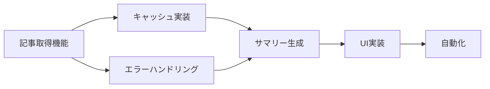

# GitHub Issues for Interest Tracker System

## Issue #1: [Feature] 関心ワード自動抽出システムの実装

### 概要
週次ブックマークから自動的に関心ワードを抽出し、トレンドを追跡するシステムを実装する

### 背景
- 毎週大量のブックマークから手動で関心事を把握するのは困難
- 興味の変化や新しいトレンドを見逃す可能性がある
- 関連する最新情報を効率的に収集したい

### 要件
- [ ] GPT APIを使用してブックマークからキーワードを抽出
- [ ] 関心ワードの頻度・重要度を分析
- [ ] 新規/継続/衰退の状態管理
- [ ] 1ヶ月以上出現しないワードは自動的にフェードアウト

### 実装タスク
- [ ] `GPTKeywordExtractor`クラスの実装
- [ ] 関心ワードのJSONストレージ
- [ ] 週次実行のcronジョブ設定
- [ ] テストケースの作成

### 参考資料
- [設計書](/interest_tracker_detailed_design.md)
- [GPT統合設計](/gpt_based_requirements.md)

---

## Issue #2: [Feature] Google検索による日次定点観測機能

### 概要
アクティブな関心ワードについて、1日1回Google検索を実行し、新しいトピックのみを収集する

### 要件
- [ ] Google Custom Search APIの統合
- [ ] 1日1回、最大10キーワードを検索
- [ ] 過去24時間の新しい記事のみ取得
- [ ] 既読URLの管理（重複除外）
- [ ] GPTによる関連性・重要度判定

### 実装タスク
- [ ] `DailyObserver`クラスの実装
- [ ] Google API認証設定
- [ ] 既読URL管理システム
- [ ] エラーハンドリング（API制限等）

### API設定
```yaml
GOOGLE_API_KEY: 環境変数に設定
CUSTOM_SEARCH_ENGINE_ID: 環境変数に設定
制限: 100クエリ/日（無料枠）
```

---

## Issue #3: [Feature] 週次レポート自動生成・配信機能

### 概要
収集した新着トピックを週次でまとめ、メールまたはSlackで配信する

### 要件
- [ ] GPTによるサマリー生成
- [ ] Markdown形式のレポート作成
- [ ] メール配信機能
- [ ] Slack webhook対応（オプション）

### レポート内容
- 今週の新着トピック（カテゴリ別）
- トレンド分析（上昇/下降）
- 重要度の高いトピックのハイライト
- 来週の注目ポイント予測

### 実装タスク
- [ ] `WeeklyReportGenerator`クラスの実装
- [ ] メールテンプレートの作成
- [ ] 配信スケジュールの設定（毎週日曜10時）
- [ ] 配信履歴の管理

---

## Issue #4: [Feature] Web UIダッシュボード

### 概要
関心ワードの状態や収集したトピックを確認できるWebインターフェース

### 要件
- [ ] 関心ワード一覧（状態別）
- [ ] トレンドグラフ表示
- [ ] 収集したトピックの閲覧
- [ ] 手動でのキーワード追加/削除
- [ ] レポート履歴の確認

### 画面構成
```
/interests
  ├── ダッシュボード
  ├── キーワード管理
  ├── トピック一覧
  └── レポート履歴
```

---

## Issue #5: [Enhancement] 関心ワードのライフサイクル管理

### 概要
関心ワードの自然な増減を管理し、古いワードを自動的にアーカイブする

### 要件
- [ ] 活性度スコアの計算（直近の出現頻度ベース）
- [ ] 状態遷移の実装（新規→アクティブ→衰退→アーカイブ）
- [ ] 復活検知（アーカイブ後の再出現）
- [ ] 興味の進化追跡（例: jQuery → React → Next.js）

### ビジネスルール
- 4週間出現なし → 観測頻度を削減
- 6週間出現なし → アーカイブ
- アーカイブ後の再出現 → 新規扱いで復活

---

## Issue #6: [Chore] 初期セットアップドキュメント

### 概要
システムを新規にセットアップする際の手順書を作成

### 内容
- [ ] 必要な環境変数の一覧
- [ ] API keyの取得方法
- [ ] cronジョブの設定方法
- [ ] 初回実行の手順
- [ ] トラブルシューティング

---

## Issue #7: [Feature] コスト監視機能

### 概要
API使用量とコストを監視し、予算超過を防ぐ

### 要件
- [ ] Google API使用量の記録
- [ ] GPT API使用量の記録
- [ ] 日次/月次のコストレポート
- [ ] 使用量アラート（80%到達時）

### 想定コスト
- Google: 無料（100クエリ/日以内）
- GPT: 約$0.30/月
- 合計: 約45円/月

---

## Issue #8: [Feature] 週次キーワードサマリー機能

### 概要
注目キーワードでブックマークされた記事の本文を取得し、週ごとに「今週のキーワードの本文のサマリー、解説」を作成する機能を実装する。全ての記事を読む時間がないユーザーのために、1ページに要約・解説をまとめて提供する。

### 背景
- ユーザーは興味のあるキーワードに関連する記事をブックマークしているが、全てを読む時間がない
- しかし、トレンドを把握するために内容は理解しておきたい
- 週ごとにキーワードごとの記事内容をサマリー化し、解説付きで1ページにまとめる必要がある

### 要件
- [ ] ブックマークされた記事のURLから本文を取得（WebFetch活用）
- [ ] キーワードごとに記事をグループ化
- [ ] GPT/Claude APIによる記事要約生成
- [ ] キーワードごとのトレンド解説と今後の展望
- [ ] 週次サマリー専用ページの作成（`/weekly/:date/summary`）

### 実装タスク
- [ ] `ArticleContentFetcher`クラスの実装
- [ ] `WeeklySummaryGenerator`クラスの実装
- [ ] サマリー用のERBテンプレート作成
- [ ] 記事取得の失敗処理とキャッシュ機能
- [ ] 週次cronジョブへの統合

### サマリーページの構成
```
週次キーワードサマリー（2025年7月第3週）
├── Kiro（AWS AI IDE）
│   ├── 今週の動向（3記事）
│   ├── 主要ポイント
│   └── 来週の注目点
├── Claude（AI Assistant）
│   ├── 今週の動向（5記事）
│   ├── 主要ポイント
│   └── 来週の注目点
└── 総括と展望
```

### 想定される課題
- 記事本文取得時のレート制限対策
- サマリー生成のAPI利用コスト
- 記事の著作権への配慮（要約のみ表示）
- 大量記事の効率的な処理

### 詳細実装計画

#### Phase 1: 基盤構築（2-3日）
1. **記事コンテンツ取得機能**
   ```ruby
   # article_content_fetcher.rb
   class ArticleContentFetcher
     def fetch_content(url)
       # WebFetchを使って記事本文を取得
       # キャッシュ機能（24時間）
       # エラーハンドリング（タイムアウト、404等）
     end
   end
   ```

2. **データ構造設計**
   ```json
   {
     "week_start": "2025-07-14",
     "keywords": {
       "Kiro": {
         "bookmarks": [
           {
             "title": "記事タイトル",
             "url": "https://...",
             "content": "取得した本文",
             "fetched_at": "2025-07-21T10:00:00+09:00"
           }
         ],
         "summary": "GPTによる要約",
         "insights": "トレンド解説"
       }
     }
   }
   ```

#### Phase 2: サマリー生成機能（2日）
1. **GPT/Claude統合**
   ```ruby
   # weekly_summary_generator.rb
   class WeeklySummaryGenerator
     def generate_keyword_summary(keyword, articles)
       # 記事群から重要ポイントを抽出
       # トレンド分析
       # 実用的な洞察の生成
     end
   end
   ```

2. **プロンプト設計**
   - 記事要約: 各記事200文字以内
   - キーワード解説: 技術トレンドと実用性を重視
   - 週次展望: 具体的なアクションアイテム

#### Phase 3: UI実装（1-2日）
1. **ルーティング追加**
   ```ruby
   get '/weekly/:date/summary' do
     # 週次サマリーページ
   end
   
   post '/weekly/:date/generate-summary' do
     # サマリー生成API
   end
   ```

2. **ERBテンプレート**
   - レスポンシブデザイン
   - キーワードごとの折りたたみ可能なセクション
   - 進捗インジケーター（生成中表示）

#### Phase 4: 最適化と自動化（1日）
1. **バッチ処理最適化**
   - 並列処理で記事取得を高速化
   - API呼び出しの最適化（バッチ処理）
   
2. **自動実行設定**
   - 週次cron（日曜日朝6時）
   - 手動実行ボタン

### 実装順序と依存関係


### コスト試算
- **記事取得**: WebFetch使用（Claude内蔵機能）
- **サマリー生成**: 
  - 週10キーワード × 各5記事 = 50記事
  - GPT-4使用時: 約$0.50/週
  - Claude使用時: API料金に準ずる
- **月間コスト**: 約$2-3（300-450円）

### リスクと対策
1. **記事取得失敗**
   - 対策: リトライ機能、代替コンテンツ表示
   
2. **API制限**
   - 対策: キューイング、優先度設定
   
3. **品質管理**
   - 対策: サンプルチェック、ユーザーフィードバック機能

### 成功指標
- 記事取得成功率: 90%以上
- サマリー生成時間: 5分以内/週
- ユーザー満足度: 読む時間を70%削減

### 承認後の開始タスク
1. `article_content_fetcher.rb`の実装開始
2. テスト用記事URLリストの準備
3. GPTプロンプトのプロトタイプ作成

---

## 実装優先順位

1. **Phase 1（MVP）**: Issue #1, #2
   - キーワード抽出と日次観測の基本機能

2. **Phase 2（レポート）**: Issue #3
   - 週次レポートで価値を可視化

3. **Phase 3（UI）**: Issue #4
   - 使いやすさの向上

4. **Phase 4（最適化）**: Issue #5, #7
   - 運用の効率化

## ラベル
- `feature`: 新機能
- `enhancement`: 機能改善
- `chore`: 設定・ドキュメント
- `high-priority`: 優先度高
- `good-first-issue`: 初心者向け