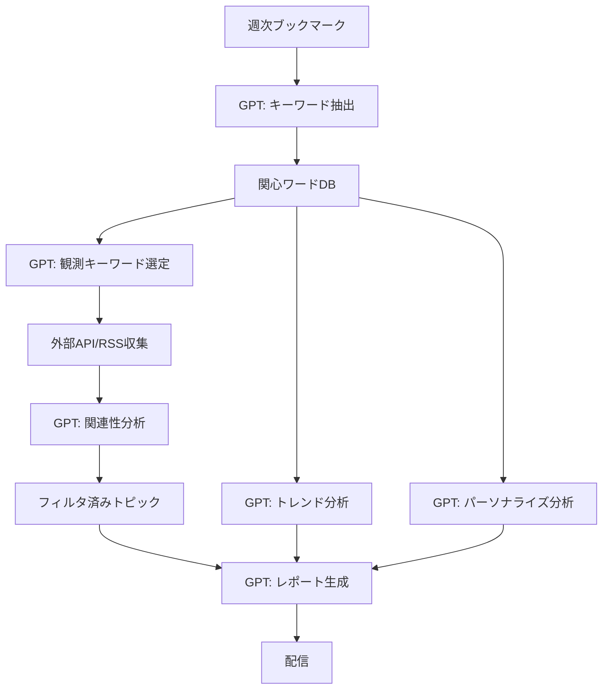

# GPT完全活用型 関心ワード定点観測システム 要件定義

## コンセプト
統計処理、分析、判断を全てGPTに委託し、人間の直感に近い柔軟な分析を実現する

## 1. GPTが担当する全タスク

### 1.1 キーワード抽出・分析
```yaml
入力: 週次ブックマーク一覧
GPTへの依頼:
  - キーワード抽出（重要度判定含む）
  - カテゴリ自動分類
  - 関連ワードのクラスタリング
  - 新規/継続/消失の判定
  - トレンド分析（上昇/下降/安定）
  - 興味の深さ分析（表面的→専門的）
  
出力: 構造化された関心ワードデータ
```

### 1.2 定点観測データの分析
```yaml
入力: 
  - 関心ワードリスト
  - 外部ソースから収集した記事/投稿
  
GPTへの依頼:
  - 関連性スコアリング
  - 重要度判定
  - カテゴリ分類
  - センチメント分析
  - トピックの要約
  - 今後の展開予測
  
出力: フィルタリング・スコアリングされたトピック
```

### 1.3 週次レポート生成
```yaml
入力:
  - 今週の関心ワード分析結果
  - 収集したトピック一覧
  - 過去の履歴データ
  
GPTへの依頼:
  - エグゼクティブサマリー作成
  - トレンド分析レポート
  - インサイト抽出
  - 推奨アクション提案
  - 来週の注目ポイント予測
  
出力: 完全な週次レポート（Markdown）
```

### 1.4 パーソナライズ分析
```yaml
入力: 過去数週間のブックマーク履歴
  
GPTへの依頼:
  - 興味の変遷分析
  - 学習曲線の把握（初心者→中級者→上級者）
  - 隠れた関心事の発見
  - 次に興味を持ちそうなトピック予測
  - 情報収集の偏り分析
```

## 2. システムフロー



## 3. GPTプロンプト設計

### 3.1 マスタープロンプト（システム全体の文脈）
```
あなたは個人の情報収集パターンを分析し、最適な情報をキュレーションする
AIアシスタントです。ユーザーのブックマーク履歴から興味・関心を深く理解し、
関連する最新情報を提供します。

ユーザーのプロファイル：
- 職業: [自動推定]
- 専門分野: [自動推定]
- 興味レベル: [各トピックごとに推定]
```

### 3.2 タスク別プロンプトテンプレート

#### キーワード抽出プロンプト
```
以下のブックマークリストから、ユーザーの関心事を分析してください。

分析の観点：
1. 頻出するトピック・技術・概念
2. 新しく現れた興味分野
3. 深掘りしているトピック（関連記事の増加）
4. 一時的な興味 vs 継続的な興味

出力形式：
{
  "core_interests": [...],
  "emerging_topics": [...],
  "deep_dive_areas": [...],
  "keyword_clusters": {...}
}
```

#### 関連性判定プロンプト
```
ユーザーの関心ワード: [リスト]
評価対象の記事: [タイトル、要約]

以下を判定してください：
1. 関連度スコア (0-100)
2. なぜ関連するか
3. ユーザーが興味を持つ可能性
4. 読むべき優先度
5. 得られる知見
```

## 4. データ最小化アプローチ

### 4.1 保存するデータ
```yaml
# 最小限のメタデータのみ保存
interest_tracking:
  - week_key: "2025-W28"
  - gpt_analysis_id: "uuid"  # GPT出力への参照
  - created_at: timestamp

# GPT出力は別途保存
gpt_outputs:
  - id: "uuid"
  - type: "keyword_extraction"
  - input_hash: "xxx"  # 入力の識別子
  - output: { GPTのJSON出力 }
  - model: "gpt-4"
  - timestamp: "2025-07-20T10:00:00Z"
```

### 4.2 統計はGPTに都度計算させる
```yaml
# 従来: DBで集計
SELECT COUNT(*) FROM interest_words WHERE...

# 新方式: GPTに質問
"過去4週間の関心ワードデータから、
 最も成長している分野を3つ教えてください"
```

## 5. ユースケース

### 5.1 週次フロー
```
日曜日 9:00
1. 今週のブックマークを取得
2. GPTでキーワード抽出（5分）
3. 関心ワードから観測キーワードを選定
4. 外部ソースから情報収集（30分）
5. GPTで関連性分析・フィルタリング（10分）
6. GPTでレポート生成（5分）
7. メール/Slack配信
```

### 5.2 インタラクティブ分析
```
ユーザー: 「最近のAI関連の興味の変化を教えて」
システム: GPTに過去のデータを渡して分析依頼
GPT: 「3週間前は一般的なChatGPT活用でしたが、
      最近はRAGやAgent実装に興味が移っています」
```

### 5.3 予測的提案
```
GPT分析: 「Rustへの興味が3週連続で上昇」
→ 提案: 「来週はRustの実践的なプロジェクトや
         パフォーマンス比較記事が出る可能性が高いです」
```

## 6. コスト最適化

### 6.1 キャッシュ戦略
- 同一ブックマークセットの分析結果は1週間キャッシュ
- 外部記事の関連性判定は1ヶ月キャッシュ

### 6.2 バッチ処理
- 関連性判定は10記事まとめて1リクエスト
- 使用モデルの使い分け（簡単なタスクはgpt-4o-mini）

### 6.3 段階的処理
```
1次フィルタ: キーワードマッチング（GPT不要）
2次フィルタ: GPT-4o-miniで簡易判定
3次フィルタ: GPT-4で詳細分析（上位10件のみ）
```

## 7. 期待される効果

1. **柔軟性**: ルールベースでは捉えられない微妙な関連性も検出
2. **文脈理解**: 「なぜ」興味があるのかまで理解
3. **予測性**: 次に興味を持ちそうなトピックの提案
4. **自然言語**: レポートが人間が書いたような自然な文章
5. **学習不要**: 機械学習モデルのトレーニング不要

## 8. 実装優先順位

### Phase 1: GPTキーワード抽出（1週間）
- ブックマーク → GPT → 関心ワード
- 基本的なWeb UI

### Phase 2: GPTレポート生成（1週間）
- 関心ワード → GPT → 週次サマリー
- メール配信

### Phase 3: 定点観測統合（2週間）
- RSS/API → GPT関連性分析 → レポート
- スケジューラー実装

### Phase 4: 高度な分析（継続）
- 予測機能
- インタラクティブ分析
- 多次元分析