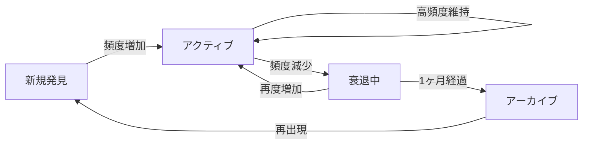

# 関心ワードのライフサイクル設計

## 1. 関心ワードの状態遷移



## 2. ライフサイクルルール

### 2.1 活性度の判定
```yaml
活性度スコア:
  - 今週の出現: 100ポイント
  - 先週の出現: 50ポイント
  - 2週前の出現: 25ポイント
  - 3週前の出現: 10ポイント
  - 4週前以前: 5ポイント

状態判定:
  - アクティブ: スコア80以上
  - 観察中: スコア30-79
  - 衰退中: スコア10-29
  - アーカイブ候補: スコア10未満が2週連続
```

### 2.2 GPTによる興味分析
```ruby
# GPTに興味の変化を分析させる
prompt = <<~PROMPT
  以下のキーワードの出現パターンを分析してください：
  
  キーワード: "NFT"
  履歴:
  - 4週前: 5回（ブーム期）
  - 3週前: 3回
  - 2週前: 1回
  - 先週: 0回
  - 今週: 0回
  
  このパターンから推測される状況:
  1. 興味を失った理由の推測
  2. 一時的な離脱か完全な興味喪失か
  3. 関連して興味が移った可能性のあるトピック
PROMPT
```

## 3. フェードアウト戦略

### 3.1 段階的な観測頻度の削減
```yaml
アクティブ期:
  - 毎日観測
  - 詳細な分析
  - トップニュース収集

観察期:
  - 週2-3回観測
  - 主要ニュースのみ
  - トレンド変化を監視

衰退期:
  - 週1回観測
  - 大きな動きのみ通知
  - 復活の兆候を監視

アーカイブ:
  - 観測停止
  - データは保持
  - 再出現時に履歴参照可能
```

### 3.2 スマートな復活検知
```ruby
# ブックマークに再度出現した場合
def handle_keyword_resurrection(keyword)
  gpt_analysis = analyze_comeback(keyword)
  
  # GPTが判定
  # - 同じトピックの再燃
  # - 新しい文脈での再登場
  # - 関連する別トピックの派生
  
  if gpt_analysis[:is_evolution]
    # 進化版として新規扱い
    create_new_interest("#{keyword} 2.0")
  else
    # 単純な復活
    reactivate_interest(keyword)
  end
end
```

## 4. 関心の進化を追跡

### 4.1 トピックの変遷
```yaml
例: Web技術への興味の変化
  Phase 1: "jQuery" → "React" → "Next.js"
  Phase 2: "REST API" → "GraphQL" → "tRPC"
  Phase 3: "Webpack" → "Vite" → "Turbopack"

GPT分析:
  "フロントエンド技術への興味が、
   より現代的で効率的なツールへと
   自然に進化しています"
```

### 4.2 興味の深化パターン
```yaml
表層的興味 → 実装興味 → 深層理解
  
例: AI/MLの場合
  Week 1-4: "ChatGPT 使い方"
  Week 5-8: "LangChain 実装"
  Week 9-12: "Transformer アーキテクチャ"
  
GPT判定: "実践フェーズから理論フェーズへ移行"
```

## 5. レポートでの扱い

### 5.1 アクティブワードセクション
```markdown
## 🔥 今週のアクティブトピック
- **Rust** (5週連続) - システムプログラミングへの関心継続
- **AI Agent** (新規) - LLMの実装から応用へシフト
```

### 5.2 フェードアウト通知
```markdown
## 📉 関心が薄れているトピック
- **NFT** - 4週間出現なし → 来週から観測頻度を削減
- **Web3** - ピーク時の20%まで減少 → アーカイブ候補
```

### 5.3 卒業したトピック
```markdown
## 🎓 卒業したトピック
これらのトピックは十分に理解/習得されたと判断：
- **Docker基礎** → より高度なKubernetes関連へ移行
- **React入門** → Next.js/Remixなど応用フレームワークへ
```

## 6. データ保持ポリシー

### 6.1 アクティブデータ
- 直近3ヶ月: 完全保持
- 詳細な分析データ
- 全観測履歴

### 6.2 アーカイブデータ  
- 3-12ヶ月: サマリーのみ
- 月次集計
- 主要なインサイト

### 6.3 長期アーカイブ
- 1年以上: 年次サマリー
- 重要なマイルストーンのみ
- 興味の大きな変化ポイント

## 7. 実装例

```ruby
class InterestLifecycleManager
  def weekly_update(bookmarks, week_key)
    current_keywords = extract_keywords(bookmarks)
    
    # 既存キーワードの更新
    @interests.each do |keyword, data|
      if current_keywords.include?(keyword)
        data[:last_seen] = week_key
        data[:activity_score] = calculate_activity_score(data)
      else
        data[:weeks_absent] += 1
      end
      
      # 状態更新
      data[:status] = determine_status(data)
    end
    
    # 新規キーワードの追加
    new_keywords = current_keywords - @interests.keys
    new_keywords.each do |keyword|
      @interests[keyword] = create_new_interest(keyword, week_key)
    end
    
    # フェードアウト処理
    fade_out_candidates = @interests.select do |_, data|
      data[:status] == 'declining' && data[:weeks_absent] >= 4
    end
    
    fade_out_candidates.each do |keyword, _|
      archive_interest(keyword)
    end
  end
end
```

## 8. メリット

1. **ノイズ削減**: 一時的な興味と継続的な興味を区別
2. **リソース最適化**: アクティブなトピックに集中
3. **自然な体験**: 人間の興味の移り変わりを反映
4. **成長の可視化**: 興味の進化を追跡可能
5. **再発見**: 過去の興味が新しい文脈で復活した時に気づける